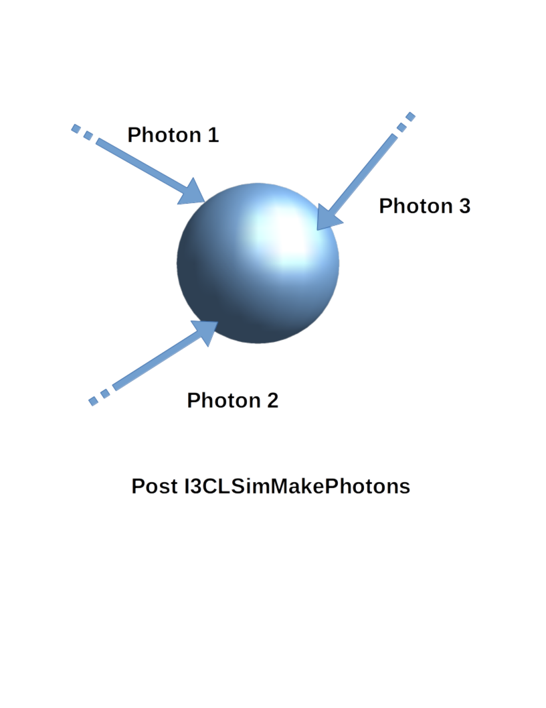
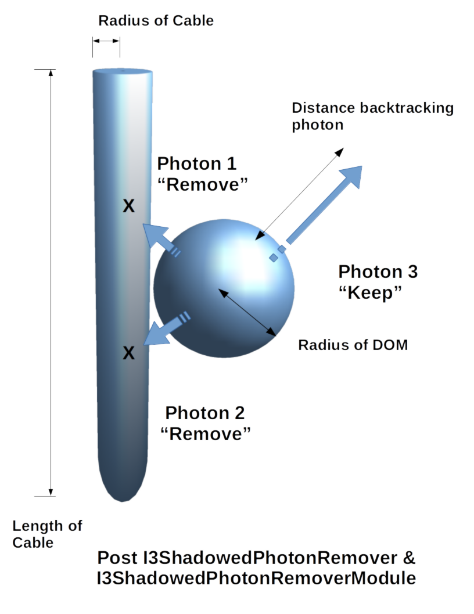

Usage
=====

This section currently only covers the standard usage of the module/service
chain for IceCube, using a fully parameterized model (i.e. without *Geant4*).

Basic usage
-----------

For a simple simulation run, you should process your I3MCTree using *MMC*.
Then, just use the supplied "tray segment" to add all relevant services
and modules to the I3Tray::

   tray.AddSegment(clsim.I3CLSimMakeHits, "makeCLSimHits")

This reads the 'I3MCTree' and 'MMCTrackList' objects from each frame
and adds hits named 'MCHitSeriesMap'. All photons are generated in a way
compatible to *ppc*.

By default, *clsim* uses only the GPU for photon propagation (i.e.
CPU devices are skipped during OpenCL device enumeration). This behavior can
be changed using the ``UseGPUs`` and ``UseCPUs`` boolean options. The following
example would only use the CPU for simulation and skip all GPU devices::

   tray.AddSegment(clsim.I3CLSimMakeHits, "makeCLSimHits",
                   UseGPUs=False, UseCPUs=True)

Generating Photons using Geant4
-------------------------------

By default, *clsim* does apply photon yield parameterizations compatible
to *ppc*. This can, however, be turned off to use a full *Geant4* simulation
run. In this case, full GPU simulation might not be necessary because the photon
generation will become the bottleneck. 

To use *Geant4*, just enable the ``UseGeant4`` switch::

   tray.AddSegment(clsim.I3CLSimMakeHits, "makeCLSimHits",
                   UseGeant4=True)

Even in this mode, *Geant4* will **not** be used for muons that have a length
assigned. These are assumed to have been generated by *MMC*. Both, neutrino-generator
and Corsika generate muons without lengths, so the module should generally
do the right thing. To make absolutely sure that no parameterizations are used,
also set the ``MMCTrackListName`` option to ``None``. This will apply *Geant4* to all
particles in the I3MCTree (which are ``InIce`` and not ``Dark``), even if they
already have a length assigned to them. (You should make sure that this is what you
really want, as MMC might already have added cascades to the muon track that would
be added a second time by Geant4.)

Low-Energy simulations
----------------------

In order to simulate low energies in a more correct way, you might want to
consider disabling the DOM oversizing optimization. It is set to an oversize
factor of 5 (in radius), which gives you a 25-fold increase in simulation
speed at the expense of accuracy in timing and for tracks very close to DOMs.

To disable DOM oversizing (which might be a good idea especially when using Geant4)
use the DOMOversizeFactor switch::

   tray.AddSegment(clsim.I3CLSimMakeHits, "makeCLSimHits",
                   DOMOversizeFactor=1., # disables oversizing (default is 5.)
                   UseGeant4=True)       # enable or disable Geant4 as needed

Ice Models
----------

By default, the 'SPICE-Mie' ice model is used. This can, however, easily be changed by
supplying either a *photonics*-compatible ice description file or a
*ppc*-compatible ice description directory using the 'IceModelLocation'
parameter::

   tray.AddSegment(clsim.I3CLSimMakeHits, "makeCLSimHits",
                   IceModelLocation=expandvars("$I3_BUILD/clsim/resources/ice/ppc_aha_0.80"))

Another example (using a *photonics* file) would be::

   tray.AddSegment(clsim.I3CLSimMakeHits, "makeCLSimHits",
                   IceModelLocation=expandvars("$I3_BUILD/clsim/resources/ice/photonics_wham/Ice_table.wham.i3coords.cos090.11jul2011.txt"))

Example Script
--------------

This is a short example script that reads an input ``.i3`` file,
applies *MMC* and *clsim* and writes the result to a second file.
It also uses Geant4 for photon generation and is configured to run
on the CPU only. In addition, adding a random number generator using
a python object (instead of a I3Service) is demonstrated.

.. highlight:: python

::

   from I3Tray import *
   from os.path import expandvars
   import os, sys

   from icecube import icetray, dataclasses, dataio, phys_services
   from icecube import clsim

   I3Seed  = 12345
   # a random number generator
   randomService = phys_services.I3SPRNGRandomService(
       seed = I3Seed,
       nstreams = 10000,
       streamnum = 1)
   tray = I3Tray()

   tray.AddModule("I3Reader","reader",
                  Filename="input.i3")

   tray.AddSegment(clsim.I3CLSimMakeHits, "makeCLSimHits",
       RandomService = randomService,
       UseGPUs=False,
       UseCPUs=True, 
       UseGeant4=True,
       IceModelLocation=expandvars("$I3_BUILD/clsim/resources/ice/spice_mie"))

   tray.AddModule("I3Writer","writer",
       Filename = "output.i3")

   tray.Execute()
   
Cable Shadow
------------

Within the IceCube Neutrino Observatory there are corrections that must be made in the simulation software to
ensure that the results are accurate. These corrections are made due to the properties of the ice such as
contamination from dust and changes in the absorption and scattering properties. Noise is also properly
simulated looking at the response of the Digital Optical Modules.

One aspect of the detector that we needed to implement was the presence of physical objects found within the
detector that were not properly implemented. This includes the cables that provide power to the DOMs and
transmit data to the surface. These cables affect the number of detected photons. Photons are completely
absorbed by the cables removing them from the simulation all together. This corresponds to about 5% of photons
produced in the simulation.

Simulating these cables were simply implemented by introducing a set of cylinders throughout the detector. Each
of these cylinders are placed next to a DOM oriented azimuthally in the direction best known to us due to
flasher data. The cylinders edge is then set to be flush with the surface of the DOM and extend vertically up
and down to a specified length to best represent the appearance of a cable. The radius of the cylinder is set to
2.3 cm which is known from construction.

Once these cables are implemented into the detector the set of photons which had been detected by each DOM is
then checked to see if they interacted with the cable. The last known direction is taken from each photon and is
then backpropagated from the surface of the DOM for a certain distance along a line. If this line intersects the
edge of the cylinder the photon is then removed from the simulation.

An example of using Cable Shadow is by first adding cylinders to the geometry::

  from icecube.simclasses import I3CylinderMap
  cable_map = I3CylinderMap()
  tray.Add(AddCylinders , Cable_map = cable_map ,Length_of_cylinder = 17.0, Radius_of_cylinder = 0.023)

Then running the I3ShadowPhotonRemoverModule to remove photons::

  tray.AddModule("I3ShadowedPhotonRemoverModule",
               "PhotonRemover",
	       InputPhotonSeriesMapName = "Photons",
               OutputPhotonSeriesMapName = "ShadowedPhotons",
               Cable_Map = "CableMap",
               Distance = 125.0)

  

