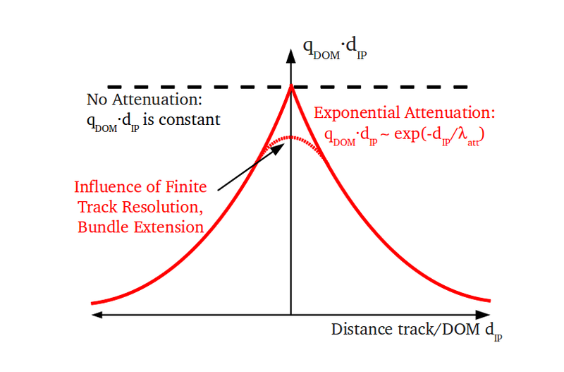

Data Derived Differential Deposition Reconstruction
---------------------------------------------------

Concept
^^^^^^^
The energy deposition of muons in matter at TeV energies mostly takes place as a series of stochastic losses. The contribution of frequent low energy losses appear as quasi-continuous. In an ideal case of a perfectly transparent medium and a well defined track, the light yield from those energy losses would fall off as 1/d, with the distance d to the track. In IceCube, the actual light yield can be approximated by an exponential fall-off as shown in the figure below.

The light attenuation parameter can be derived from data by fitting the number of photo electrons measured as a function of the distance to a track for various depths in the detector.

A detailed description of the concept can be found in the `IceCube wiki <https://wiki.icecube.wisc.edu/index.php/IC79_Atmospheric_Muons/DDDDR>`_.
