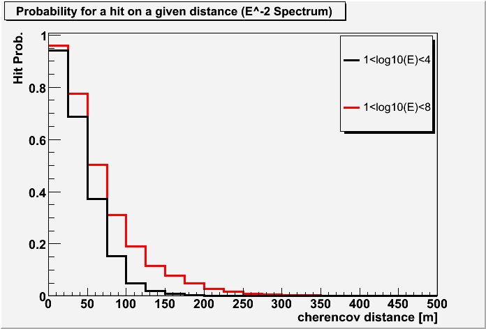

Calculation of Probabilities
~~~~~~~~~~~~~~~~~~~~~~~~~~~~

The determination of the probability for a DOM to have a physics hit can be described by different approaches. This probability is one of the most important parts in many of the algorithms included in finiteReco. Thus, it is worth investigating them. Three approaches to obtain the hit probabilities are described here:

* a simple parametrization
* photonics
* MC data

There are also other approaches possible and tested. Céline Terranova worked on a more sophisticated description by a parametrization. It is included in FiniteReco as PhPnhPerpParam. Please note that it is strongly recommended to use the photonics method, PhPnhPhotorec. The other modes should be used for testing at best.

Simple Parametrization (PhPnhParam)
^^^^^^^^^^^^^^^^^^^^^^^^^^^^^^^^^^^

A simple approach is to use a parametrization for the hit probability. Here an old formula from AMANDA is used with the parameters determined there. For a DOM, the probability to have a hit is:

:math:`P = \exp \left(-\frac{d}{l} \cdot \left( 1+\ln \left(1 + \frac{t \cdot c_{\text{ice}}}{l} \right) \right) \right)`

Here, :math:`d` is the effective perpendicular distance of the DOM from the track:

:math:`d = 3.1 \text{m} - 3.9 \text{m} \cdot \cos(\eta) + 4.6 \text{m} \cos^2(\eta) + 0.86 \cdot d_{\text{perp}}`

:math:`l = 98 \text{m}` is the absorption length, :math:`t = 557 \text{ns}`, and :math:`c_{\text{ice}}` is the speed of light in ice. 

This formula is a simple exponential decrease with larger distance from the track. Additionally the probability is zero when no Cherenkov light can reach the DOM. No scattering is taken into account, simple linear propagation of the light is assumed. This approach is easy to calculate and therefore a very fast method.

Photonics (PhPnhPhotorec)
^^^^^^^^^^^^^^^^^^^^^^^^^

The Photorec tables describe the light propagation in ice and provide the expected number of photo electrons for a minimum ionizing particle for all DOMs. Assuming Poison statistics, the probability for a physics hit (more than zero photo electrons) is calculated. This approach achieves the best results, but is also the most computation (and above all memory) intensive.

MC simulations (PhPnhMCDist)
^^^^^^^^^^^^^^^^^^^^^^^^^^^^

Here, dedicated tables were created from simulated neutrino events. For each simulated event, the distance to all DOMs which could be reached by Cherenkov light was calculated. Again, only straight propagation of the light was assumed. At each distance the ratio of hit and not hit DOMs was determined and added to a table. This was done for 200k events with an :math:`E^{-2}` energy spectrum. The figure below shows the obtained hit probability as a function of distance for two different energy ranges.

Only distances below 200 m have high probabilities for a hit. Beyond 400 m nearly no chance for a hit exists. High-energy events increase the maximum distance at which the light can be observed.

How to use
^^^^^^^^^^

The project is implemented to be used with gulliver. Thus, the likelihood function is provided by :cpp:class:`I3GulliverFinitePhPnhFactory` and loaded as a service into the frame. The installed pointer is used by the gulliver reconstruction module::

   tray.AddService("I3GulliverFinitePhPnhFactory","finitephpnh",
      DOMHitProb          = 0.1,
      finiteDefaultLength = 2*I3Units.km,
      InputReadout        = "PulseSeriesMap",
      NoiseRate           = 700.0*I3Units.hertz,
      OnlyInfiniteTables  = False,
      PhotorecName        = "PhotorecService",
      ProbName            = "PhPnhPhotorec",
      RCylinder           = 300*I3Units.m,
      SelectStrings       = [1,2,3,4,5,6,7,8,9],
      UseOnlyFirstHit     = True
   )

* ``DOMHitProb``: all DOM's with a hit probability higher than this value are included in the multiplicity
* ``finiteDefaultLength``: default length for finite photonics calls (only required with ``PhPnhPhotorec``)
* ``InputReadout``: input pulse series map
* ``NoiseRate``: average noise rate of DOMs
* ``OnlyInfiniteTables``: use only infinite photonics tables (only required with ``PhPnhPhotorec``)
* ``PhotorecName``: name of the photorec service in the frame (only required with ``PhPnhPhotorec``)
* ``ProbName``: method for calculating the propabilities: ``PhPnhMCDist`` or ``PhPnhParam`` or ``PhPnhPhotorec``
* ``RCylinder``: only DOMs inside this radius are used
* ``SelectStrings``: only DOMs on these strings are used
* ``UseOnlyFirstHit``: If ``True``, the result only depends on whether a DOM is hit or not. For ``False`` also the number of hits is taken into account, if the method chosen with ``ProbName`` supports this.

Output
^^^^^^

The service itself has no return parameters. The reconstruction by the gulliver project returns a reconstructed track as I3Particle and some fit parameters. For more detail visit the gulliver pages.

