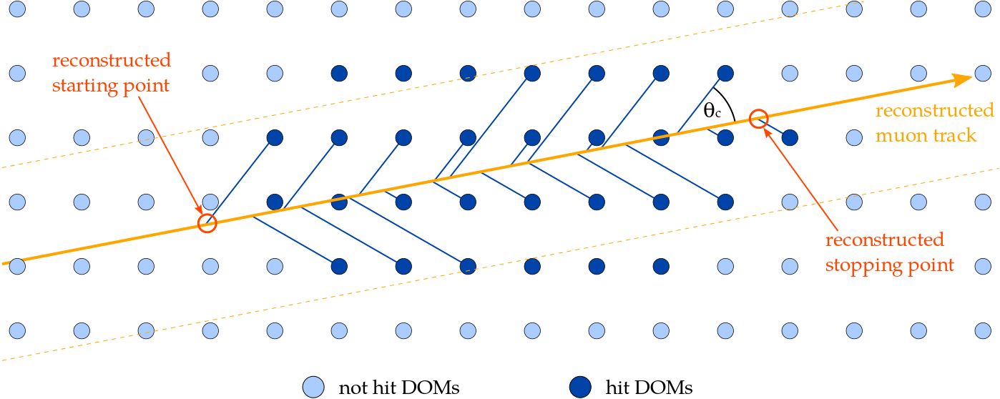

First Guess of a Start/Stop Point
~~~~~~~~~~~~~~~~~~~~~~~~~~~~~~~~~

Likelihood reconstructions of finite tracks must be seeded with a finite first guess. This module provides a first guess for the start and stop point.
An existing infinite reconstruction of a muon track (linefit, SPE, ...) is required as input. For all hits of the event the emission point of Cherenkov light on the track is calculated. The start and stop point are then set to the two emission points with the largest distance to each other. The figure below shows an illustration of this process.

This method provides start and stop points for all events. The type of the event is not determined here. This has to be done by other methods (e.g. `Starting/Stopping Likelihood <I3StartStopLProb.html>`_).

How to use
^^^^^^^^^^

This algorithm is implemented in the module :cpp:class:`I3StartStopPoint`::

   tray.AddModule("I3StartStopPoint","FiniteReco1stGuess", 
      Name            = "LineFit",
      InputRecoPulses = "PulseSeriesMap",
      CylinderRadius  = 200*I3Units.m,
      ExpectedShape   = 70              # Contained Track
   )

* ``Name``: name of the input I3Particle
* ``InputRecoPulses``: input pulse series map
* ``CylinderRadius``: only DOMs inside this radius are used for the calculations
* ``ExpectedShape``: either starting, stopping, or contained track

Output
^^^^^^

This module returns a stopping, starting or contained I3Particle (depending on what you set for ``ExpectedShape``), and additionally some cut values (I3FiniteCuts) to identify starting, stopping and contained events.

* ``"Name"_Finite``: the altered input track, with the vertex set to the start point (if ``ExpectedShape`` was set to starting or contained) or the stop point (if ``ExpectedShape`` was set to stopping), and the length set to the reconstructed value. Other parameters stay unchanged compared to the seed I3Particle.
* ``"Name"_FiniteCuts``: An I3FiniteCuts object, containing several cut values. An explanation is given on the `I3FiniteCuts <I3FiniteCuts.html>`_ page.
