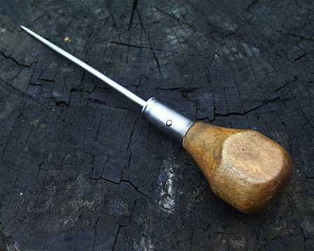

.. _icepick:

Icepick 
=======
This is a small project that contains modules which filter events out 
of an icetray chain of modules.

.. warning::
   This project is obsolete, as many of these tasks are done trivially in python.
   There is no need to write new icepicks.

Overview
--------
	   
There is one module template
the :ref:`I3IcePickModule` which takes one template parameter.  The type that
is the template argument encodes the logic that you want to apply to 
determine if the event should be filtered.  There is a base class
:ref:`I3IcePick` that can be used as a base class for these template arguments.  
The I3IcePick has a configuration interface identical to the :ref:`I3Module`
class so you can ``'AddParameter'`` in any :ref:`I3IcePick` constructor and
``'GetParameter'`` in the ``'Configure()'`` method of any :ref:`I3IcePick` subclass.  
These configuration parameters become part of the configuration interface
of the ``I3IcePickModule<YourType>``.  

The base :ref:`IcePickModule` class has a parameter ``"NEventsToPick"`` (default -1).
If set to a positive value, it will issue a ``"RequestSuspension"`` after that
many Physics frames have passed the pick.  Combine with the :ref:`I3UnFilter`
for a simple way to select ``NPhysicsFrames``. See the examples in ``resources/scripts``.

There is a second module :ref:`I3IceForkModule` which, rather than just losing the 
filtered events, pushes them to a second outbox ``TrashBox``.

The results of the icepick module are written to frame as a :ref:`I3Bool` with configurable parameter 'decisionname'.  If this is set to "" then the nothing is written to the frame.  

Additionally, icepick modules can now be used as keys for conditional execution.  See: http://wiki.icecube.wisc.edu/index.php/Conditional_Execution

A catalog of icepicks available is on the wiki:  http://wiki.icecube.wisc.edu/index.php/Icepicks

Adding to IcePick
------------------

Adding new filters is as simple as adding a new :ref:`I3IcePick` subclass.  You 
also have to make sure that the :ref:`I3IcePickModule` template is instantiated and 
registered for your class.  You can add your template instantiations to the
``ModuleExport.cxx`` file and they will get compiled in.

Also note, icepick is part of offline-software, which has a slow release process.  IcePicks do
not have to live in project icepick, but can be anywhere (just dependent on project interfaces.)

See Also
--------

.. toctree::
   :maxdepth: 1
   
   release_notes
   Python API Reference </python/icecube.icepick>
   C++ API Reference </doxygen/icepick/index>
   IceTray Inspect Reference </inspect/icepick>

