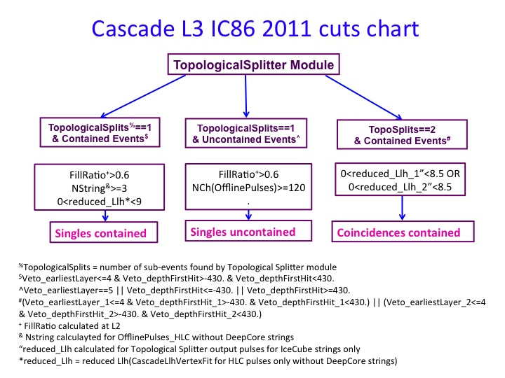
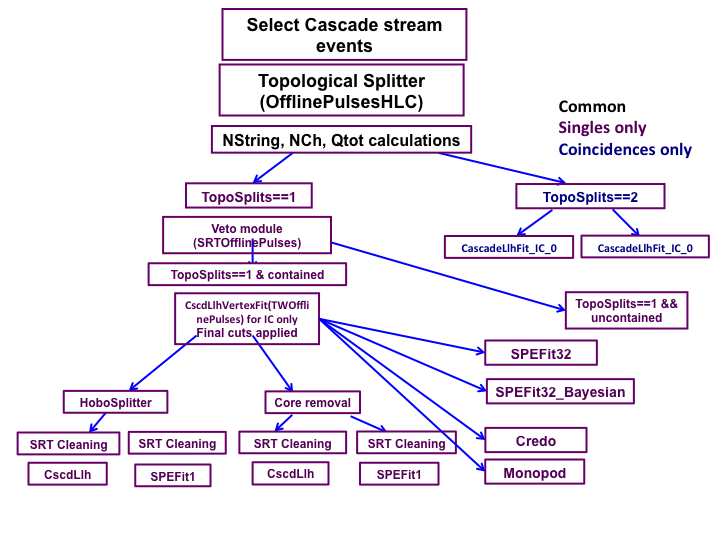

..
.. @author Mariola Lesiak-Bzdak 
.. $LastChangedBy: Yiqian Xu $
.. $LastChangedDate: 2016-03-08 13:09:44 -0600 (Tue, 08 Mar 2016) $

.. _level3-filter-cascade:   

level3-filter-cascade
=====================

.. toctree::
   :maxdepth: 1
   
   release_notes

Introduction
------------
The aim of the Cascade L3 processing is to reduce the size of the dataset (at least by factor of 30) 
while maintaining the atmospheric and extraterrestrial signals efficiency as high as possible, in 
order to have a fast processing and no storage problems.

The idea is to use `Toplological Splitter <http://code.icecube.wisc.edu/svn/projects/TopologicalSplitter/trunk>`_ module first and identify coincident events: number of output splits maps corresponds to number of sub-events found. Detailed description of the Topological Splitter method for identifying coincident events can be found `here <https://wiki.icecube.wisc.edu/index.php/Coincident_Corsika_Events_Removal>`_ 

After identifying event "multiplicity" we run VetoModule from `CascadeVariables <http://code.icecube.wisc.edu/svn/projects/CascadeVariables>`_ project and separate events

The general flowchart of L3 cuts for IC86 2011 - present is shown below:

Detailed Cascade L3 flow chars is shown below:

Reconstruction
--------------
Keys that are created at Cascade Level3 are listed in the table below

+---------------------------------+---------------------------------+----------------------------------------+
| Name                            | Description                     | Function used                          |
+=================================+=================================+========================================+
| CscdL2_Topo_HLCSplitCount       | number of sub-events found by   | icecube.level3_filter_cascade.         |
|                                 | Topological Splitter module     | level3_TopoSplitter.TopologicalCounter |
+---------------------------------+---------------------------------+----------------------------------------+
| Veto_SRTOfflinePulses           | Containment info for Single     | icecube.level3_filter_cascade.         |
|                                 | Events                          | level3_RunVeto.runVeto_Singles         |
+---------------------------------+---------------------------------+----------------------------------------+
| Veto_CscdL2_Topo_HLC0           | Containment info for Double     | icecube.level3_filter_cascade.         |
| Veto_CscdL2_Topo_HLC1           | Events                          | level3_RunVeto.runVeto_Coinc           |
+---------------------------------+---------------------------------+----------------------------------------+
| CscdL3_Cont_Tag                 | Indicates which branch from the | icecube.level3_filter_cascade.         |
|                                 | flowchart this event belong to  | level3_Cuts.tagBranches                |
+---------------------------------+---------------------------------+----------------------------------------+
| NCh_OfflinePulsesHLC            | NChannel and NString calculated | icecube.level3_filter_cascade.         |
| NCh_OfflinePulsesHLC_noDC       | using different pulses with     | level3_MultiCalculator.multiCalculator |
| NCh_OfflinePulsesHLC_DCOnly     | deep core exclusion or only     |                                        |
| NCh_OfflinePulses               | deep core.                      |                                        |
| NCh_OfflinePulses_noDC          | NString_OfflinePulsesHLC_noDC   |                                        |
| NCh_OfflinePulses_DCOnly        | is used for single contain      |                                        |
| NCh_SRTOfflinePulses            | branch cutting.                 |                                        |
| NCh_SRTOfflinePulses_noDC       | NCh_OfflinePulses is used for   |                                        |
| NCh_SRTOfflinePulses_DCOnly     | single uncontained branch       |                                        | 
| Nstinrg_OfflinePulsesHLC        | cutting                         |                                        |
| Nstring_OfflinePulsesHLC_noDC   |                                 |                                        |
| Nstring_OfflinePulsesHLC_DCOnly |                                 |                                        |
| Nstring_OfflinePulses           |                                 |                                        |
| Nstring_OfflinePulses_noDC      |                                 |                                        |
| Nstring_OfflinePulses_DCOnly    |                                 |                                        |
| Nstring_SRTOfflinePulses        |                                 |                                        |
| Nstring_SRTOfflinePulses_noDC   |                                 |                                        |
| Nstring_SRTOfflinePulses_DCOnly |                                 |                                        |
+---------------------------------+---------------------------------+----------------------------------------+
| NCh_CscdL2_Topo_HLC0            | NChannel and NString calculated | icecube.level3_filter_cascade.         |     
| NCh_CscdL2_Topo_HLC0_noDC       | using the splitted pulses for   | level3_MultiCalculator.multiCalculator |
| NCh_CscdL2_Topo_HLC0_DCOnly     | double events with deep core    |                                        |
| NCh_CscdL2_Topo_HLC1            | exclusion or only deep core     |                                        |
| NCh_CscdL2_Topo_HLC1_noDC       |                                 |                                        |
| NCh_CscdL2_Topo_HLC1_DCOnly     |                                 |                                        |
| NString_CscdL2_Topo_HLC0        |                                 |                                        |
| NString_CscdL2_Topo_HLC0_noDC   |                                 |                                        |
| NString_CscdL2_Topo_HLC0_DCOnly |                                 |                                        |
| NString_CscdL2_Topo_HLC1        |                                 |                                        |
| NString_CscdL2_Topo_HLC1_noDC   |                                 |                                        |
| NString_CscdL2_Topo_HLC1_DCOnly |                                 |                                        |
+---------------------------------+---------------------------------+----------------------------------------+
| CascadeLlhVertexFit_ICParams    | General Cascade llh w/o DC,used | icecube.level3_filter_cascade.         |
|                                 | for single contain branch       | level3_Recos.CascadeLlhVertexFit       |
|                                 | cutting                         |                                        |
+---------------------------------+---------------------------------+----------------------------------------+
| CascadeLlhVertexFit_IC          | Two CscdLlhVertexFits w/o DC    | icecube.level3_filter_cascade.         |
| _Coincidence0Params             | for doubles contained branch    | level3_Recos.CascadeLlhVertexFit       |
| CascadeLlhVertexFit_IC          | cutting                         |                                        |
| _Coincidence1Params             |                                 |                                        |
+---------------------------------+---------------------------------+----------------------------------------+
| CscdL3_SPEFit16                 | Track Fit                       | icecube.level3_filter_cascade.         |
|                                 |                                 | level3_HighLevelFits.HighLevelFits     |
+---------------------------------+---------------------------------+----------------------------------------+
| CscdL3_CascadeLlhVertexFit      | Cascade LLH reconstruction      | icecube.level3_filter_cascade.         |
|                                 |                                 | level3_HighLevelFits.HighLevelFits     |
+---------------------------------+---------------------------------+----------------------------------------+
| SPEFit16Seed                    | Bayesian Track LLH              | icecube.level3_filter_cascade.         |
|                                 | reconstruction                  | level3_HighLevelFits.HighLevelFits     |
+---------------------------------+---------------------------------+----------------------------------------+
| CscdL3_Credo_SpiceMie           | Credo 1 iteration               | icecube.level3_filter_cascade.         |
|                                 | reconstruction                  | level3_HighLevelFits.CredoReco         |
+---------------------------------+---------------------------------+----------------------------------------+
| L3_MonopodFit4                  | Monopod 4 iteration             | icecube.level3_filter_cascade.         |
|                                 | reconstruction                  | L3_monopod.L3_Monopod                  |
+---------------------------------+---------------------------------+----------------------------------------+
| TimeSplit_SPEFit_0              | Split an event into halves on   | icecube.level3_filter_cascade.         |
| TimeSplit_SPEFit_1              | the charge-weighted mean time,  | level3_Recos.TimeSplitFits             |     
| TimeSplit_CascadeLlhVertexFit_0 | run SPEFit, CascadeLlFit and    |                                        |
| TimeSplit_CascadeLlhVertexFit_1 | DipoleFit on each half          |                                        |
| TimeSplit_DipoleFit_0           |                                 |                                        |
| TimeSplit_DipoleFit_1           |                                 |                                        |
+---------------------------------+---------------------------------+----------------------------------------+
| CoreRemoval_SPEFit_0            | Remove the cascade-like core of | icecube.level3_filter_cascade.         |
| CoreRemoval_SPEFit_1            | pulses around a reconstructed   | level3_Recos.CoreRemovalFits           |
| CoreRemoval                     | vertex from the event, and run  |                                        |
| _CascadeLlhVertexFit_0          | SPEFit, CascadeLlFit and        |                                        |
| CoreRemoval                     | DipoleFit on the core and       |                                        |
| _CascadeLlhVertexFit_1          | corona separately               |                                        |
| CoreRemoval_DipoleFit_0         |                                 |                                        |
| CoreRemoval_DipoleFit_1         |                                 |                                        |
| _CascadeLlhVertexFit_0          |                                 |                                        |
+---------------------------------+---------------------------------+----------------------------------------+

Argument Setting
----------------

level3-filter-cascade/python/level3_Master.py is the excitable script used for running Cascade Level3 processing. Below is a list of arguments you can and should set when running this script.

+----------------------+-------------------------------------+----------------------------+
| Name                 | Default                             | Description                |
+======================+=====================================+============================+
| -i/--input           | None                                | the full name and location |
|                      |                                     | of the input file          |
+----------------------+-------------------------------------+----------------------------+
| -g/--gcd             | None                                | the full name and location |
|                      |                                     | of the GCD file            |
+----------------------+-------------------------------------+----------------------------+
| -o/--output          | None                                | the full name and location |
|                      |                                     | of the output file         |
+----------------------+-------------------------------------+----------------------------+
| -m/--MC              | False                               | Use False when processing  |
|                      |                                     | data, otherwise use True   |
+----------------------+-------------------------------------+----------------------------+
| --amplitudetablepath | /cvmfs/icecube.opensciencegrid.org/ | AmplitudeTable used by     |
|                      | data/photon-tables/splines/         | Credo and Monopod          |
|                      | ems_mie_z20_a10.abs.fits            |                            |
+----------------------+-------------------------------------+----------------------------+
| --timingtablepath    | /cvmfs/icecube.opensciencegrid.org/ | TimingTable used by Credo  |
|                      | data/photon-tables/splines/         | and Monopod                |
|                      | ems_mie_z20_a10.prob.fits           |                            |
+----------------------+-------------------------------------+----------------------------+
| -n/--num             | -1                                  | Don't need to set unless   |
|                      |                                     | you only want to process   |
|                      |                                     | certain number of frames   |
+----------------------+-------------------------------------+----------------------------+
| -y/--year            | 2015                                | Detector year of the data  |
|                      |                                     | or mc you are processing   |
+----------------------+-------------------------------------+----------------------------+

