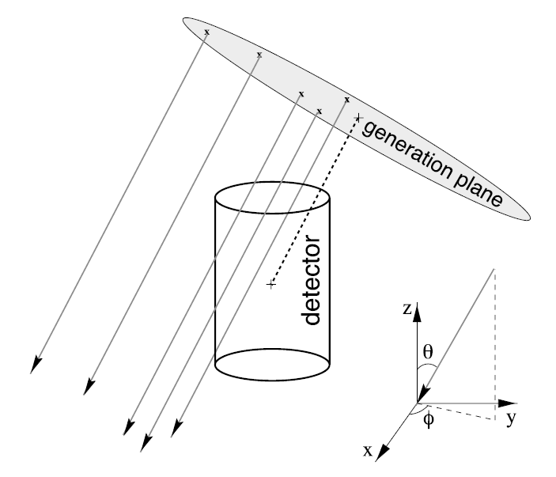

..
.. copyright  (C) 2004 - 2014
.. The Icecube Collaboration
..
.. $Id$
..
.. @date $Date$
.. @author Emanuel Jacobi (emanuel.jacobi@desy.de)

Monopole Generator
==================

This a project providing the module to generate magnetic monopoles in IceCube.
The monopole generator creates and initializes the basic data structures needed by the other components of the simulation chain.
The monopoles starting points are randomly placed on a disk with a direction perpendicular to it as shown in the plot below.
The disk itself is randomly rotated around the detector center to simulate an isotropic flux.
This module supports the simulation of relativistic and sub-relativistic monopoles, independent of their interaction types.
It is supposed to use it directly before the I3MonopolePropagator module in the monopole-propagator project
where several interaction types are implemented and where new types should be implemented.

See the verification that this algorithm leads to an isotropic flux in the PhD Thesis of the primary author Brian Christy:
https://docushare.icecube.wisc.edu/dsweb/Get/Document-67876/Brian_Cristy_thesis.pdf

To learn more about the classes and variables in the source code have a look in to the doxygen_ documentation.

I3MonopoleGenerator
-------------------

I3MonopoleGenerator is the I3Module to generate monopoles events. For each event an I3MCTree is created, that contains a monopole as it's primary I3Particle.
An info dictionary containing important simulation parameters is also written for each event and saved in the i3 file.
You can use it to double check simulation success and to remember important parameters for later use.

The configuration parameters are listed below.

The velocity of the monopole (expressed in either beta or gamma) is mandatory and no default is given.
Relativistic monopoles need the mass as well, in order to calculate the energy which is needed to determine the energy-loss during the propagation.
You can also define a second velocity so that the generator simulates a uniform velocity distribution in the given range.
If you define a power law index additionally, a power law distribution is simulated and the corresponding weights are written to the dictionary mentioned above. NOTE: If you use weighting you need to execute resources/scripts/NormalizeWeighting.py afterwards to get the right weights!

The radius and distance of the generation disk has to be choosen depending on the detector size in order to obtain an isotropic flux.
The default should be okay for IC86.

For directional studies the zenith and azimuth of the monopole direction can be restricted to an interval.
If the lower bound equals the upper bound the random generator will not be invoked and the monopole will be generated with a fixed direction.
Furthermore the starting position on the generation disk can be set to a fixed value.

See the example script how to use this module. You have to implement a random service and an InfiniteSource module before starting this module.

Parameters
^^^^^^^^^^

**TreeName**    (*I3MCTree*)
	Name of the I3MCTree containing the monopole.

**InfoName**    (*MPInfoDict*)
        Name of the monopole info dictionary, containing all necessary information about the generation parameters.

**Disk_dist**    (*1000*)
        Distance of generation disk from the center of IceCube.

**Disk_rad**    (*800*)
        Radius of the generation disk.

**Gamma**    (*NaN*)
        Velocity of the monopole expressed as Lorentz Factor. Either ``Gamma`` or ``BetaRange`` can be set.

**BetaRange**    *([NaN, NaN])*
        Velocity of the monopole expressed as ratio of c. Configure as with a list containing the lower and the upper value of the velocity ditribution (as ratio of c). If a fixed beta value is desired, configure with a list containing only one value, or set the begin and the end of the range to the same velocity.  Either ``Gamma`` or ``BetaRange`` can be set.

**PowerLawIndex**   (*NaN*)
        If a velocity range is simulated, use a power law with the given index instead of a uniform velocity distribution. This can be helpful to gain statistics for low velocities. If a non uniform velocity distribution is simulated, reweigthing is neccessary. Use the provided script NormalizeWeighting.py.

**Mass**    (*NaN*)
        Mass of the monopole. For slow monopoles this parameter is optional.

**Length**    (*2/*Disk_dist**)
        Length of the monopole track. Can be NaN or any length. The default value is calculated to twice the disk distance.

**ZenithRange**    *([0.0\*I3Units::deg,180.0\*I3Units::deg])*
        List of lower and upper zenith bound. Use this parameter to restrict the direction of the monopole.

**AzimuthRange**    *([0.0\*I3Units::deg,360.0\*I3Units::deg])*
        List of lower and upper azimuth bound.  Use this parameter to restrict the direction of the monopole.

**Rand_pos**    (*true*)
        Allows to switch off the randomization of the starting position on the generation disk. This is useful for directional studies in conjunction with restricting the zenith and azimuth of the monopole.
        If set to ``false`` it is mandatory to set ``Rad_on_disk`` and ``Azi_on_disk``.

**Rad_on_disk**    (*NaN*)
        Set the radius coordinate of the starting position on the generation disk. Only vaild if ``Rand_pos=false``.

**Azi_on_disk**    (*NaN*)
        Set the azimuth of the starting position on the generation disk. Only vaild if ``Rand_pos=false``.

**ShiftCenter**    *([0.,0.,0.])*
        Shifts the monopole. This is useful to explore different geometries. To shift according to the center of DeepCore (IC86-I SLOP trigger only acts on DC) configure with ``ShiftCenter=([46.0\*icetray.I3Units.meter, -34.5\*icetray.I3Units.meter, -330.0\*icetray.I3Units.meter])``.

.. _doxygen: ../../doxygen/monopole-generator/index.html
