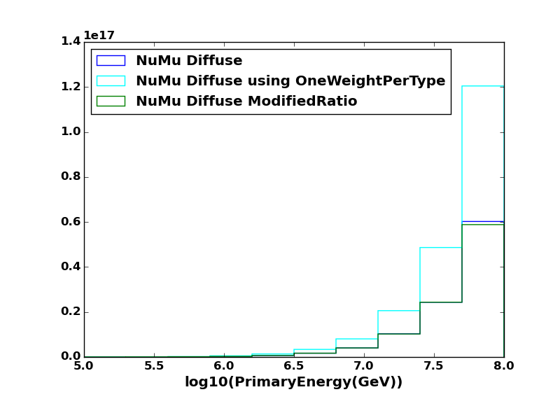

Parameters in I3MCWeightDict
-------------------------------------

Parameters removed or renamed (after V04-01-XX)
^^^^^^^^^^^^^^^^^^^^^^^^^^^^^^^^^^^^^^^^^^^^^^^^^^^

How to convert new parameters to old parameter names
""""""""""""""""""""""""""""""""""""""""""""""""""""

Following parameters are obsolete and not stored in I3MCWeightDict any more. 

If you want to restore them, use neutrino-generator/resources/examples/fill_old_weights.py. Add following lines to your analysis script::

 from fill_old_weights.py import fill_old_weights
 tray.Add(fill_old_weights,"renameweights")

After the line, I3MCWeightDict contains old parameters too.

InjectionSurfaceR
"""""""""""""""""
Injection surface area was renamed to CylinderRadius.

ActiveLengthBefore and ActiveLengthAfter
""""""""""""""""""""""""""""""""""""""""
No one actually uses these values then removed.
Instead, sum of them (ActiveLengthBefore + ActiveLengthAfter) is stored as CylinderHeight.

GeneratorVolume
"""""""""""""""
Removed because it's easy to calculate from other parameters.

 GeneratorVolume = pi * CylinderRadius * CylinderRadius * CylinderHeight

AutoExtension
"""""""""""""
If 1 is set, detection area was extended with muon-range dynamically event by event.
By default, 1 for NuMu and NuTau, 0 for NuE.
This parameter should be same for all simulation set and it's obvious from generation script, then it is removed.
If you need to use the value in your script use::

 if (RangeInMWE <= 0) :
     AutoExtension = 0
 else :
     AutoExtension = 1

TotalInteractionProbabilityWeight
"""""""""""""""""""""""""""""""""
Renamed because the name is too long and the name does not represent correct idea.
New name is "TotalWeight". 

TotalInteractionProbability
"""""""""""""""""""""""""""""""""
Renamed to InteractionWeight

TotalPropagationProbability
"""""""""""""""""""""""""""""""""
Renamed to PropagationWeight

TotalCrosssectionCGS
"""""""""""""""""""""""""""""""""
Renamed to TotalXsectionCGS

InteractionCrosssectionCGS
"""""""""""""""""""""""""""""""""
Renamed to InteractionXsectionCGS

InjectionAreaNormCGS
"""""""""""""""""""""""""""""""""
Renamed to InjectionAreaCGS

TotalDetectionLength
"""""""""""""""""""""""""""""""""
Removed because it's easy to calculate from other parameters.

.. code-block:: none

 TotalDetectionLength = TrueActiveLengthBefore + TrueActiveLengthAfter

RangeInMeterWaterEquiv
"""""""""""""""""""""""""""""""""
Renamed to RangeInMWE

Parameters should be same for all events in a file
^^^^^^^^^^^^^^^^^^^^^^^^^^^^^^^^^^^^^^^^^^^^^^^^^^^
These parameters may be stored in s-frame, because they are not eveyt-by-event parameters.

NEvents
"""""""""""""""""""""""""""""""""
Generated number of events per file.

CAUTION:This is total number of events per file, with neutrino and anti-neutrino.
When you weight with "per particle type" (e.g. atmospheric neutrino flux), the required number of event per file should be "per particle type" (it is known as famous factor 2 for atmospheric neutrino weight).

If you use **OneWeightPerType** parameter instead of **OneWeight**, you don't need to compensate the factor.

CylinderRadius
"""""""""""""""""""""""""""""""""
Radius of injection cylinder (for CIRCLE injection mode) or detection cylinder (for SURFACE injection mode)

CylinderHeight
"""""""""""""""""""""""""""""""""
Height of injection cylinder (for CIRCLE injection mode) or detection cylinder (for SURFACE injection mode)

InjectionAreaCGS
"""""""""""""""""""""""""""""""""
Was InjectionAreaNormCGS. Injection area of primary neutrino, in cm^2

SolidAngle
"""""""""""""""""""""""""""""""""
Injection solid angle. If the source is pointsource, this parameter is set to 0 (to make consistent with definition of OneWeight)

MinZenith, MaxZenith
"""""""""""""""""""""""""""""""""
primary zenith range (for diffuse source)

MinAzimuth, MaxAzimuth
"""""""""""""""""""""""""""""""""
primary azimuth range

MinEnergyLog, MaxEnergyLog
"""""""""""""""""""""""""""""""""
primary energy range in log10

PowerLawIndex
"""""""""""""""""""""""""""""""""
Power law index of primary neutrino (generation flux)

Primary particle info
^^^^^^^^^^^^^^^^^^^^^^^^^^^^^^^^^^^^^^^^^^^^^^^^^^^

Latest I3MCWeightDict contains minimal primary information required for weighting process.

* PrimaryNeutrinoAzimuth
* PrimaryNeutrinoZenith
* PrimaryNeutrinoType
* PrimaryNeutrinoEnergy

Following parameters are for point source only, the input direction info.

* PointSourceZenith
* PointSourceZenithSigma
* PointSourceAzimuth
* PointSourceAzimuthSigma

NInIceNus
"""""""""""""""""""""""""""""""""
Number of arrival neutrinos to the detector.

Examples:

* Injected one NuMu : NInIceNus = 1
* Injected one NuTau and regeneration process occurred, arrived N nus : NInIceNus = N
* Injected 100 NuTau and only one NuTau is selected to process NuGen, and regeneration process increased the child neutrinos N : NInIceNus = 100 + N -1 (-1 for removing double counting of selected neutrino) 

Interaction info at detection volume (final interaction)
^^^^^^^^^^^^^^^^^^^^^^^^^^^^^^^^^^^^^^^^^^^^^^^^^^^^^^^^

BjorkenX
"""""""""""""""""""""""""""""""""
Bjorken's X parameter for final interaction. See InteractionBase::SetSecondaryLepton() for how it is used.
(used to calculate outgoing angle between InIce neutrino and a secondary track)

BjorkenY
"""""""""""""""""""""""""""""""""
Bjorken's Y parameter for final interaction. 
 out_lepton_E = (1 - y) * nu_energy

TotalColumnDepthCGS
"""""""""""""""""""""""""""""""""
Total column depth within detection volume. The value is used to calculate TotalWeight. Unit is [g/cm^2].

InteractionColumnDepthCGS
"""""""""""""""""""""""""""""""""
Column depth from the entrance position of the detection volume to the interaction vertex position. Unit is [g/cm^2].

TotalXsectionCGS
"""""""""""""""""""""""""""""""""
Total cross section at final interaction vertex. Unit is [cm^2].

InteractionXsectionCGS
"""""""""""""""""""""""""""""""""
Cross section of selected interaction at the interaction vertex. Unit is [cm^2].

InteractionType
"""""""""""""""""""""""""""""""""
interaction type (integer, see EnumTypeDef.h)

LengthInVolume
"""""""""""""""""""""""""""""""""
geometrical length from the entrance position of the detection volume to the interaction vertex position

RangeInMeter
"""""""""""""""""""""""""""""""""
Used muon range converted to length [m] for InIce Neutrino Energy

RangeInMWE
"""""""""""""""""""""""""""""""""
Used muon range in [m.w.e] for InIce Neutrino Energy

ImpactParam
"""""""""""""""""""""""""""""""""
Closest distance [m] from InIce neutrino trajectory to IceCube center 
(not a closest position of InIce Track or Cascade)

EnergyLost
"""""""""""""""""""""""""""""""""
Used only for tau. Total energy loss of Tau particle before it decayes (end energy of the tau track). Unit is [GeV].

TrueActiveLengthBefore
"""""""""""""""""""""""""""""""""
Distance from most closest position of a neutrino trajectory to IceCube center to the entrance of detection volume. Unit is [m].

TrueActiveLengthAfter
"""""""""""""""""""""""""""""""""
Distance from most closest position of a neutrino trajectory to IceCube center to the exit of detection volume. Unit is [m].

Weights
^^^^^^^^^^^^^^^^^^^^^^^^^^^^^^^^^^^^^^^^^^^^^^^^^^^

TotalWeight
"""""""""""""""""""""""""""""""""
Renamed from TotalInteractionProbabilityWeight.
This is the total weight to compensate all weighted simulation in NuGen EXCEPT FOR TypeWeight.
See InteractionInfo::GetTotalWeight() for details.

OneWeight
"""""""""""""""""""""""""""""""""
Chad's "OneWeight". See `this document for details <https://docushare.icecube.wisc.edu/dsweb/Get/Document-44937/OneWeight.pdf>`_. Unit is [GeV sr cm^2].

.. code-block:: none

 OneWeight = TotalWeight[unitless] * InjectionArea[cm^2] * SolidAngle[sr] * (IntegralOfEnergyFlux/GenerationEnergyFlux)[GeV]

If you use only one dataset or datasets with same energy range and zenith range or datasets which does not have any overwrap in energy range and zenith range, you may use pre-stored OneWeight to get event weight.

You may use `Weighting Module <http://software.icecube.wisc.edu/simulation_trunk/projects/weighting/>`_ instead of using OneWeight, as long as your Nu:NuBar ratio is 1:1 (If not, you may need to tweak the factor 2). However, all ingredients to calculate oneweight is stored in I3MCWeightDict, so that you may construct your oneweight for your own use.

how to weight with atmospheric neutrino flux using OneWeight
''''''''''''''''''''''''''''''''''''''''''''''''''''''''''''
prepare atmospheric flux. Use NewNuFlux module or neutrinoflux module.
For how to use neutrinoflux, see `Chad's note <https://docushare.icecube.wisc.edu/dsweb/Get/Document-44937/OneWeight.pdf>`_.
Both flux modules returns values with a unit of [:math:`GeV^{-1} sr^{-1} cm^{-2} sec^{-1}`].

.. code-block:: python

 flux = NewNuFlux.makeFlux('honda2006').getFlux
 ptype = I3MCWeightDict["PrimaryNeutrinoType"]
 energy = I3MCWeightDict["PrimaryNeutrinoEnergy"]
 cos_theta = cos(I3MCWeightDict["PrimaryNeutirnoZenith"]
 type_weight = I3MCWeightDict["TypeWeight"]
 nevts = I3MCWeightDict["NEvents"]
 oneweight = I3MCWeightDict["OneWeight"]
 nfiles = (number of files you used)
 
 N = flux(ptype, energy, cos_theta) * oneweight / (type_weight * nevts * nfiles)

Note that atmospheric neutrino flux is given PER TYPE. Since we generate both Nu and NuBar, we have to compensate number of generated events with the production-ratio of each primary type. With a default setting, we generate Nu:NuBar = 1:1 so that the type_weight is always 0.5. 

how to weight with :math:`E^{-2}` flux using OneWeight
''''''''''''''''''''''''''''''''''''''''''''''''''''''''''''

.. code-block:: python

 energy = I3MCWeightDict["PrimaryNeutrinoEnergy"]
 nevts = I3MCWeightDict["NEvents"]
 oneweight = I3MCWeightDict["OneWeight"]
 nfiles = (number of files you used)
 
 N = norm * pow(energy, -2) * oneweight / (nevts * nfiles)

The "norm" is one of the physics parameters to fit in most cases. N represents number of total neutrinos plus anti-neutrinos.
The equation above has been used long time, however, if we want to change production ratio of Nu and NuBar, this formula is not applicable any more. Use **OneWeightPerType**.

OneWeightPerType
"""""""""""""""""""""""""""""""
For a better understanding, read about **OneWeight** first.

Similar to OneWeight but contains compensation factor of TypeWeight. Unit is [GeV sr cm^2].

.. code-block:: none

 OneWeightPerType = TotalWeight[unitless] * InjectionArea[cm^2] * SolidAngle[sr] * (IntegralOfEnergyFlux/GenerationEnergyFlux)[GeV] / TypeWeight[unitless]

If you use the OneWeightPerType instead of OneWeight, weighting equation will change as follows.

how to weight with atmospheric neutrino flux using OneWeightPerType
'''''''''''''''''''''''''''''''''''''''''''''''''''''''''''''''''''

.. code-block:: none

 flux = NewNuFlux.makeFlux('honda2006').getFlux
 ptype = I3MCWeightDict["PrimaryNeutrinoType"]
 energy = I3MCWeightDict["PrimaryNeutrinoEnergy"]
 cos_theta = cos(I3MCWeightDict["PrimaryNeutirnoZenith"]
 nevts = I3MCWeightDict["NEvents"]
 oneweightpertype = I3MCWeightDict["OneWeightPerType"]
 nfiles = (number of files you used)

 N = flux(ptype, energy, cos_theta) * oneweightpertype / (nevts * nfiles)

We don't need to divide (nevts * nfiles) by a factor of 2, because this factor is included in oneweightpertype.

how to weight with :math:`E^{-2}` flux using OneWeightPerType
'''''''''''''''''''''''''''''''''''''''''''''''''''''''''''''''''''

.. code-block:: none

 ptype = I3MCWeightDict["PrimaryNeutrinoType"]
 nevts = I3MCWeightDict["NEvents"]
 oneweightpertype = I3MCWeightDict["OneWeightPerType"]
 nfiles = (number of files you used)
 
 N = norm * 0.5 * pow(energy, -2) * oneweightpertype / (nevts * nfiles)

The factor of 0.5 on numerator is required to make the definition of norm same as current IceCube definition.

Here is the breakdown. If we count neutrino and anti-neutrino separately:

.. code-block:: python

 import numpy as np

 primary_type = I3MCWeightDict["PrimaryNeutrinoType"]
 energy = I3MCWeightDict["PrimaryNeutrinoEnergy"]
 type_weight = I3MCWeightDict["TypeWeight"]
 oneweight = I3MCWeightDict["OneWeight"]
 nevts = I3MCWeightDict["NEvents"]
 nfiles = (number of files you used)

 cut_nu = (primary_type == 14)
 cut_nubar = (primary_type == -14)

 N_nu = norm_for_nu * np.pow(energy[cut_nu], -2) * oneweight[cut_nu] / (type_Weight[cut_nu] * nevts[cut_nu] * nfiles)
 N_nubar = norm_for_nubar * np.pow(energy[cut_nubar], -2) * oneweight[cut_nubar] / (type_weight[cut_nubar] * nevts[cut_nubar] * nfiles)

Then, you fit the N_nu + N_nubar with data. If we assume norm_for_nu = norm_for_nubar = norm_per_type (Nu:NuBar = 1:1), those equations will be

.. code-block:: python

 N_nu = norm_per_type * np.pow(energy[cut_nu], -2) * oneweight[cut_nu] / (type_Weight[cut_nu] * nevts[cut_nu] * nfiles)
 N_nubar = norm_per_type * np.pow(energy[cut_nubar], -2) * oneweight[cut_nubar] / (type_weight[cut_nubar] * nevts[cut_nubar] * nfiles)

However, since we (historically) use "sum of Nu and NuBar" (norm_for_nu + norm_for_nubar) for estimation of astrophysical flux, we have to double the "norm_per_type" to get same value as old definition. Because the "norm_per_type" is a fit parameter, we need to multiply a compensation factor 0.5 to double the "norm_per_type"

.. code-block:: python

 N_all = norm_for_all * 0.5 * pow(energy, -2) * oneweight / (type_weight * nevts * nfiles)

then norm_for_all will be a factor two larger than norm_per_type. 

Instead of using oneweight / type_weight, you may use OneWeightPerType, because

.. code-block:: python

 oneweightpertype = oneweight / type_weight

The following figure shows comparison of three NuGen outputs. Blue and Cyan is generated with NuMu:NuMuBar = 1:1. Blue uses OneWeight for weighting. Cyan uses OneWeightPerType instead but missing factor 0.5 on numerator of weight. Green is generated with NuMu:NuMuBar=1.2 , using OneWeightPerType for weight and multiplied factor 0.5 to numerator.

DirectionWeight
""""""""""""""""""""""""""""""""
Stores direction weight to compensate zenith-weighted generation (cf. ZenithWeightParam)

TypeWeight
""""""""""""""""""""""""""""""""
This parameter gives the ratio of the given particle type.
For standard production, we generate Nu:NuBar 1:1 so that the parameter is always 0.5.

To keep consistency of the definition of OneWeight, the TypeWeight parameter is not included in TotalWeight and OneWeight.
On the other hand, OneWeightPerType parameter contains the factor of TypeWeight. 

SelectionWeight
""""""""""""""""""""""""""""""""
This is used only when we select a neutrino from neutrino bunch (e.g. atmospheric neutrino from corsika event).

PropagationWeight
""""""""""""""""""""""""""""""""
Weight of InEarth propagation, to compensate forbidding CC interaction.

InteractionPositionWeight
""""""""""""""""""""""""""""""""
This will be negligible for energy less than EeV. For such high E neutrino, the interaction vertex should concentrate on the beginning of the detection volume, while we uniformly distribute the vertex point within the detection volume. This parameter compensate the effect.

InteractionWeight
""""""""""""""""""""""""""""""""
The interaction probability that a neutrino will make one interaction within a detection volume.

