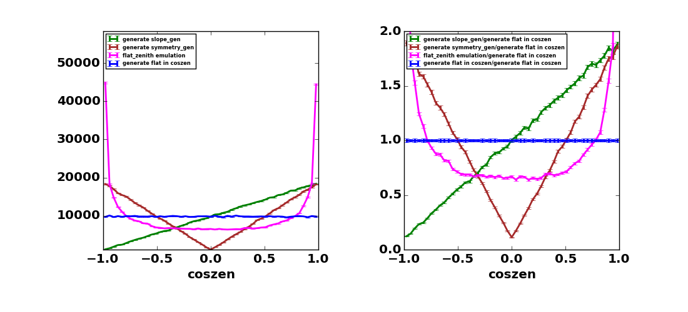

Weights in NuGen
----------------

What are production weights?
^^^^^^^^^^^^^^^^^^^^^^^^^^^^

The production weights consist of weights that enhance number of simulated (and triggered) events at the detector. 
They are totally artificial weights, has no relation with physics parameters, and must be applied event by event to get reasonable results.

*In order to get physics histograms under assumption of Atmospheric neutrino
or any physical astro-neutrino, you have to apply another weight using
`OneWeight` or weighting module*

NuGen suports many production weights, Here is some examples.

* Zenith weight. For example, we may generates more vertical events than horizontal events to increase number fo simulated (and triggered) events from the bottom of the detector.
* Forbid CC interaction inside the Earth so that all neutrinos are propagated
  up to near by the IceCube detector (weighted propagation)
* Make force interaction inside a detection volume near by the IceCube
  (weighted interaction)

The propagation weight was always 1 for version V00-05-04 or older, and
configurable from version V00-05-05 or later.

.. CAUTION::

   Do not use weighted propagation for NuTau!
   To switch on Tau's neutrino regeneration, the propagation mode for tau flavor must be 
   "NoPropWeight" or "AutoDetect". 

Zenith Weight
^^^^^^^^^^^^^

Why do we need zenith weight?
"""""""""""""""""""""""""""""
The uniform distribution (diffuse) follows flat distribution in cos(zenith) space, therefore our observable follows flat distribution in cos(zenith).
For years we used to generate simulation with flat distribution in cos(zenith).
Recently, with some analysis, we encountered statistical shortage of simulation at vertical directions. To solve the issue, several weighting functions are newly provided.

The statistical shortage at vertical direction happens by nature of sampling flat in cos(zenith).
Because cos(zenith) contains the factor of solid angle, for example, number of simulated event at 180 degrees is always zero due to the solid angle = 0, while at 90 degrees the solid angle is 2*pi.

The purpose of simulation is not emulating nature, but understanding averaged behavior of our reconstruction in each angle. For physics analysis, we should avoid penalties that depend on zenith angle as much as possible. Generating flat in cos(zenith) enhances strong penalty at vertical directions.

The figures show the number of generated events for each generation mode, and their statistical errors (in percent). Injected number of events is 500000.

Statistical errors will be smaller when we increase total number of generating events. One solution may be keep injection mode as flat in cos(zenith), and adding special datasets that covers only vertical directions. However, this solution requires extra works for simulation production team. For users who want to use OneWeight will need to re-calculate OneWeight by hand for combined simulation.   

Considering these extra works, the latest NuGen sets emulation mode of flat in zenith (ANGEMU mode) as default. In order to generate with old style, set AngleSamplingMode as "COS". 

Control zenith weight
"""""""""""""""""""""
To control zenith distribution of generated events, set following parameters to I3NuGInjector or I3NuGDiffuseSource.
Generation weight (DirectionWeight) is included in I3MCWeightDict.TotalWeight and I3MCWeightDict.OneWeight (OneWeightPerType). As long as a user uses these weights, no change is needed for analysis scripts.
If you construct your weight from the scratch, do not forget to multiply I3MCWeightDict.DirectionWeight.

* **AngleSamplingMode** 

  *COS* :
    Sample zenith angles in cos(zenith). Simulating diffuse sample. 

  *ANG* :
    Sample zenith angles in angle. This option doesn't calculate weight to weight back to flat in cos(zenith),     due to singular points at coszen -1 and 1. Unless you can provide reasonable directional weights, 
    do not use the option for physics analysis. 
    This option is useful when you are interested in only the ratio of two datasets or parameters, 
    such as ratio of primary neutrinos vs inice neutrinos.
 
  *ANGEMU* :
    Emulating ANG mode but allows to weight back to COS mode, therefore can be used for physics analysis.
    It separates ANG distribution in sections, and each section it uses 1 dim polynominal function to sample
    cos(zenith). 

* **ZenithWeightParam** 
  This setting is active only when you select COS mode for AngleSamplingMode.
  Set float value from 0.1 to 1.9. Default is 1.0, which gives flat distribution in cos(zenith) or zenith (depending on the value in AngleSamplingMode).  A larger number gives more vertical events. 
  For details, see `ZenithSampler::SimpleSlopeSampler<http://code.icecube.wisc.edu/projects/icecube/browser/IceCube/projects/neutrino-generator/trunk/private/neutrino-generator/utils/ZenithSampler.h`.

Followng figures show number of generated events in several injection modes, before weigting and after weighting. 

BLUE    : using "COS" mode and ZenithWeightParam = 1.0
GREEN   : using "COS" mode and setting ZenighWeightParam 0.1
MAGENTA : using "ANGEMU" mode and ZenithWeightParam = 1.0
BROWN   : (currently not supported)

Propagation Weight
^^^^^^^^^^^^^^^^^^

Overview of NuGen propagation
"""""""""""""""""""""""""""""

* Calculate total path length inside the Earth using injected neutrino
  geometry. Separate the total path length into propagation area
  (distance SF) and detection volume (distance FE).
* Define a step length dx[m] using propagation area (distance SF) and
  step number nx. Default nx is 10000.
* In each step, calculate a column depth within dx[m] and an Earth's
  density at the step point.
* Calculate a total cross section at the step point.
* Calculate a probability that the injected neutrino interacts within
  the step. Try Monte-Carlo, and decide whether an interaction happened
  within the step.
* If any interaction occurred, Choose an interaction with another random toss.

  * If CC-interaction is selected with injection particle NuMu or NuE, stop
    the propagation so that this event is killed. Start new propagation with
    a new particle.
  * For other cases, generate secondaries and go to the next step.

* If nothing happens, go to the next step.
* finish propagation when the injected neutrino and generated secondaries
  reach to the front surface of detection volume (point F), then process a
  weighted interaction.

Weighted Propagation
""""""""""""""""""""

If we activate weighted propagation, the procedure 6 is modified.

NuGen always choose NC or GR interaction, then apply a propagation weight as 

.. math::
   (\sigma_{NC} + \sigma_{GR}) / (\sigma_{NC} + \sigma_{CC} + \sigma_{GR})

   GR: Glashow resonance (if applicable)

Note that the verdict whether any interaction happens or not (procedure 5)
is done based on the total cross section *which includes CC interaction,*
even if we select weighted propagation.

Following figures show that the final (weighted) number of events of weighted
propagation and non-weighted propagation matches well within statistical
errors. The plot shows OneWeight parameter (which is proportional to the
number of events) for starting or contained events only. OneWeight parameter
depends on detection volume sizes, therefore we always have to compare number
of "triggered" events to do a reasonable comparison.

Parameters to control weighted propagation
""""""""""""""""""""""""""""""""""""""""""

Set parameter to I3NeutrinoGenerator or I3NeutrinoPropagator.

* **PropagationWeightMode** 

  *NoPropWeight* :
    Do *not* activate propagation weight. Propagation weight
    is always 1. 
  
  *NCGRWeighted* :
    Activate propagation weight, CC interaction is forbidden during
    In-Earth propagation.
  
  *AutoDetect* :
    Use NCGRWeighted for NuE, NuMu and NoPropWeight for NuTau. *(default)*
  
  *Legacy* :
    This option activates old event class. If you want to reproduce
    NuGen V00-05-04 or older, use it. (propagation weight is 1)

* Use **NoPropWeight** or **AutoDetect** option for NuTau simulation

Interaction Weight
^^^^^^^^^^^^^^^^^^

If neutrino(s) reach to the front surface of detection volume, NuGen makes
force interaction somewhere inside the detection volume. Interaction weight
must be applied in order to compensate it.

.. note::

   In the case of NuTau simulation, we may have multiple neutrinos at the
   front surface of detection volume. However, NuGen randomly chose only
   one of them to make force interaction, with taking into account of
   "total interaction probability inside the detection volume" of each
   neutrino candidate. Theoretically we might have two (or more) neutrinos
   interacted inside the detection volume, but the probability of this
   type of event should be negligibly small. On the other hand, taus
   generated inside propagation area and reached to the detection volume
   will be stored and handed over to the mmc program.

A pure interaction weight is defined as:

.. math::
   P_{surviving} = exp(-\sigma_{all} * L_{d} / M_{p} * C)

   P_{interaction} =  1 - P_{surviving}
    
where

   :math:`L_{d}` : total column depth within the detection volume [:math:`g/m^2`]

   :math:`M_{p}` : proton mass [:math:`g`]

   :math:`\sigma_{all}` : total cross section at interaction point [:math:`mb`]

   :math:`C` : unit conversion factor 1.0e-31 (1[:math:`mb`] = 1.0e-31[:math:`m^2`])
 
This is a part of total interaction weight, because NuGen samples
interaction position with a flat probability distribution function

.. math::
   P_{pos\_NuGen}(X) = 1 / L_{d}
    
where 
    
   :math:`X` : interaction column depth from the entrance of detection
   volume to the interaction position [:math:`g/m^2`]

instead of using the following exponential distribution

.. math::
   P_{pos\_True}(X) = 1 / sum * exp(- \sigma_{all} * X / M_{p} * C)

   sum = \int_0^{L_d}  exp(- \sigma_{all} * X / M_{p} * C) dX 

Thus we need to apply a position weight too.

.. math::
   \begin{align}
   W_{pos} & = P_{pos\_True}(X) / P_{pos\_NuGen}(X) \\
   & =  (L_{d} / sum) * exp(- \sigma_{all} * X / M_{p} * C) \\
   \end{align}

The net interaction weight is then expressed as:

.. math::
   W_{interaction} = P_{interaction} * W_{pos}

If you want to calculate interaction weight by yourself, I3MCWeightsDict
provides all information you need. See following parameters:

Feb.2.2020 Part of the "Names in I3MCWeightDict" was fixed to correct value.

========================  ========================    ==========================
 Variables                    Units                    Names in I3MCWeightDict
========================  ========================    ==========================
:math:`W_{interaction}`   (unit less)                 (not stored) << FIXED!
:math:`P_{interaction}`   (unit less)                 InteractionWeight
:math:`W_{pos}`           (unit less)                 InteractionPositionWeight  << FIXED!
:math:`L_{d}`             :math:`g/cm^{2}`            TotalColumnDepthCGS
:math:`X`                 :math:`g/cm^{2}`            InteractionColumnDepthCGS
:math:`\sigma_{all}`      <s>mb</s> :math:`cm^{2}`    TotalXsectionCGS
:math:`M_{p}`             g                           Not stored, use a constant value *1.6726215e-24*
:math:`C`                                             If you use the valiables listed above, use 1.0
========================  ========================    ==========================

Weights for physics analysis
^^^^^^^^^^^^^^^^^^^^^^^^^^^^

In order to use simulation, users must multiply all production weights and initial flux, as well as weights defined by generation space. We usually use OneWeight or GenerationWeight for this purpose. 

In I3MCWeightDict, all production weights listed above are multiplied into **TotalWeight**. So, basically, OneWeight is:

.. code-block:: none

 OneWeight = TotalWeight[unitless] * InjectionArea[cm^2] * SolidAngle[sr] * (IntegralOfEnergyFlux/GenerationEnergyFlux)[GeV]

For more details see section "Parameters in I3MCWeightDict". 
