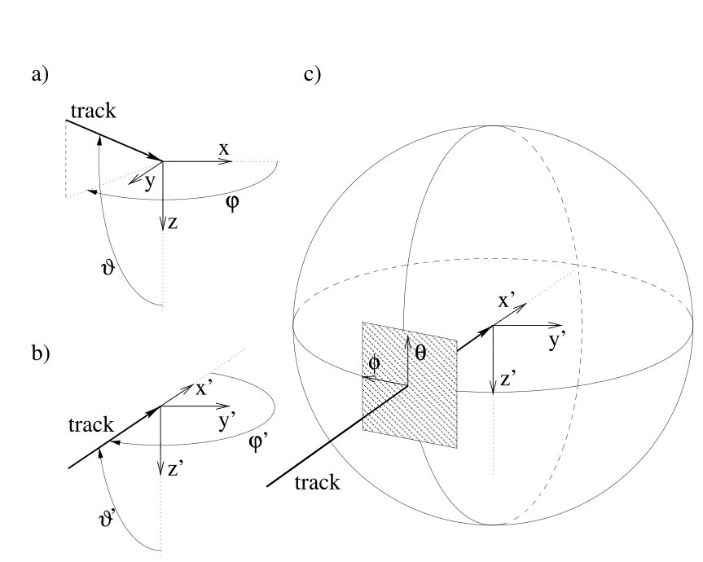
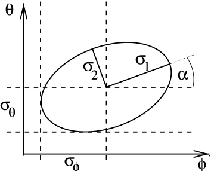
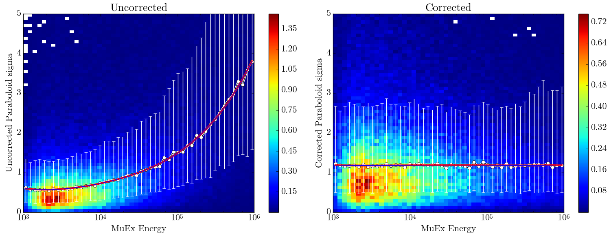
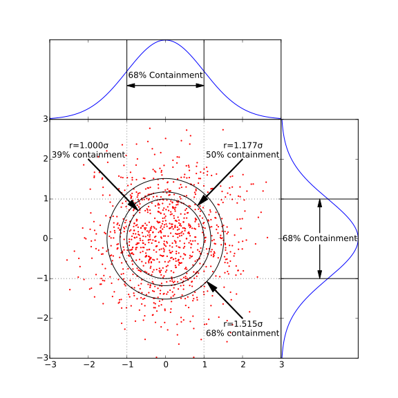

.. _paraboloid:

==========
Paraboloid
==========

Paraboloid is an gulliver module for calculating the spatial uncertainty of muon track reconstruction.

Maintainer: Kevin Meahger

.. toctree::
   :maxdepth: 1

   release_notes

Overview
========

IceCube uses the method of maximum likelihood to reconstruct the direction of muon tracks. The uncertainty of these reconstructions can be estimated by investigating the likelihood space in the region near the likelihood. The likelihood
space near the minimum of such a reconstruction is usually shaped like a normal distribution (also known as a Gaussian), hence the log likelihood space will end up shaped like a parabola. 
The standard procedure for analysing the uncertainty of a maximum likelihood estimation is to find the 1σ contour of the likelihood space around the minimum. In the case where some of the parameters are considered nuisance parameters, the space is explored only in the parameters of interest, by constructing a grid of points in the parameters of interest and holding them constant while the likelihood is minimized over the nuisance parameters. 
Paraboloid then does as χ\ :sup:`2` fit to the resulting grid to a paraboloid and calculates the parameters of the error ellipse.
The word "paraboloid" refers to a two-dimensional parabola, which is the expected shape of the log-likelihood space near the minimum under most conditions.
Assuming the log-likelihood space is a paraboloid the 1 sigma contour should be an ellipse.

Paraboloid is part of the Gulliver suite and uses the same parameterization, and minimizations services as other gulliver reconstructions.
A more detailed description of the paraboloid algorithm can be found in Till Neunhöffer's thesis\ [#]_ or the paraboloid paper\ [#]_.

History
=======

The original ideas and implementation for the paraboloid fitter were developed by Till Neunhoeffer while he worked as a PhD student with professor Lutz Koepke at Mainz University, Germany. Till originally implemented paraboloid in the recoos program, part of the rdmc-based siegmund framework. Marc Hellwig (also a PhD student in Mainz) ported the program to sieglinde, introducing ROOT classes to facilitate a lot of the equation solving. Marc's implementation was easy to separate into three logical parts:

* a part that interacts with the host framework to obtain the likelihood grid
* a framework-independent part which performs the actual algorithm to fit a paraboloid to the grid
* an output part which stores the communicates the results back to the framework. This structure allowed an easy port to gulliver/icetray, which was done in July/August 2006. Chad added the status variable which can be used to diagnose very accurately what went wrong with a failed fit, so that the configuration of the fit, or the implementation itself, can be improved in a relatively effective way. Chad and Jon did a lot of analysis and testing with paraboloid and used it for the first point source analysis with IceCube (IC9).

The following is a list of people who have contributed to paraboloid over the years:

* Till Neunhoeffer 
* Lutz Koepke 
* Marc Hellwig
* Timo Griesel
* Chad Finley 
* David Boersma
* Jon Dumm 

Implementation Details
=======================

In IceCube, muon tracks are parameterized by 5 parameters: zenith, azimuth, x, y, and z of the vertex. To estimate the angular uncertainty, zenith and azimuth are the parameters of interest and x,y and z are considered nuisances parameters. Paraboloid constructs a grid of Zenith, Azimuth points near the minimum, for each point on the grid it does a 3 parameter minimization for the vertex holding Zenith and Azimuth constant. 
The likelihood values for each point on the grid are then fit to paraboloid using a χ\ :sup:`2` minimization. 

To avoid spherical artifacts near the coordinate poles, Paraboloid first rotates the grid so that the seed track is along the equator of the coordinate system.

   Figure 1. Shows the coordinate systems used by paraboloid a) shows a track in a  
   in the detector's Cartesian coordinate system (x, y, z). The
   direction towards the track’s origin is described with standard spherical
   coordinates (ϑ, φ). Note the use of AMANDA coordinate system with the z-axis
   pointing downward.
   b) A rotated coordinate system (x', y', z') is presented, where the x'-axis is 
   defined by the track. To describe directions that are close to the track’s
   direction, relative coordinates θ = ϑ' − π/2 and ϕ = φ' − π are introduced. 
   They are approximately the coordinates in the tangent plane, as shown in c).

The coordinates near the equator are locally orthogonal. To simplify the algorithm, Paraboloid performs the grid scan on the tangent plane instead of on the surface of the sphere. The maximum error introduced by this approximation is of the order of 0.15% for distances less than 5 degrees.

Usage
======

Steering File
-------------

The following is an example steering file for calling paraboloid:

.. code-block:: python

   tray.AddService("I3GulliverMinuitFactory", "Minuit",
                   MaxIterations=1000,
                   Tolerance=0.01)

   tray.AddService("I3BasicSeedServiceFactory", "ParaboloidSeed"+Suffix,
                   InputReadout=Pulses,
                   FirstGuesses=[Seed],
                   TimeShiftType="TFirst",
                   NChEnergyGuessPolynomial=
                   [0.9789139, 1.173308, 0.3895591])
	
   tray.AddService("I3GulliverIPDFPandelFactory",      
                   "MPEParaboloidPandel"+Suffix,
                   InputReadout=Pulses,
                   Likelihood="MPE",
                   PEProb='GaussConvolutedFastApproximation',
                   JitterTime=4.0 * I3Units.ns,
                   NoiseProbability=noiserate * I3Units.hertz)
        
   tray.AddModule("I3ParaboloidFitter", "MPEFitParaboloid2"+Suffix,
                  SeedService="ParaboloidSeed"+Suffix,
                  LogLikelihood="MPEParaboloidPandel"+Suffix,
                  MaxMissingGridPoints=1,
                  VertexStepSize=5.0 * I3Units.m,
                  ZenithReach=2.0 * I3Units.degree,
                  AzimuthReach=2.0 * I3Units.degree,
                  GridpointVertexCorrection="ParaboloidSeed"+Suffix,
                  Minimizer="Minuit",
                  )

The ``I3GulliverMinuitFactory`` and the ``I3GulliverIPDFPandelFactory`` should be the same service or be called identically to the services used on the original reconstruction. The ``I3BasicSeedServiceFactory`` should point to the original reconstruction's frame object. The options for these services can be found in the `liliput inspect docs <../../inspect/lilliput.html>`_. The full options for the `I3ParaboloidFitter` module can be found in the 
`paraboloid inspect docs <../../inspect/paraboloid.html>`_

It is important to note that many of the defaults are what was deemed appropriate for AMANDA, so it is important to use a small step size. 

Results
--------

The result of the paraboloid is stored in the icetray frame in an ``I3Particle`` with the zenith and azimuth as the location of the center of the paraboloid. Unfortunately, the information is not very useful as the location of the original minimization is a better estimate of the true track direction. The more useful information is stored in the frame as a ``I3ParaboloidFitParams``.

The most important parameters are the length of the semimajor and semiminor axes of the 1σ error ellipse, which are stored in the ``I3ParaboloidFitParams`` frame object as ``pbfErr_`` and ``pbfErr2_`` respectively.
This ellipse won't necessarily be orientated with the zenith azimuth coordinate system.
The rotation angle of the semi-major axis is stored in ``pbfRotAng_`` but since it in AMANDA coordinates it is with respect to the negative azimuthal direction. The projection of the ellipse into the zenith and azimuth are stored in ``pbfSigmaAzi_`` and ``pbfSigmaZen_``. 

   
   Figure 2: The confidence ellipse in θ and φ can be represented either by σ\ :sub:`θ`, σ\ :sub:`φ`, 
   and the covariance cov(θ, φ) or by the major and minor axes σ\ :sub:`1` and σ\ :sub:`2`, 
   and the rotation angle α of the ellipse between the major axis and the θ-direction.

When using the results of Paraboloid is always very important to
use the paraboloid status. In case of a (partial) failure the track
variables are not necessarily set to NAN. You only want to use the
results with ``pbfStatus_``==0 (``PBF_SUCCESS``). The non-zero value of the paraboloid
status tells you exactly what went wrong; this can help you to improve
the configuration of the fitter modules or to diagnose problems.
Negative values occur when paraboloid cannot successfully complete the fit, positive values occur after additional checks, when the fit is deemed "not good", Zero (``PBF_SUCCESS``) means everything was okay. The complete list of of possible values are available in the `class documentation <../../doxygen/paraboloid/classI3ParaboloidFitParams.html#a1a24250cbcea80a321623b3f4a21e9c6>`_.
Paraboloid provides much more information about the fit, the complete list of values provided can be found in the `c++ documentation <../../doxygen/paraboloid/classI3ParaboloidFitParams.html>`_.

In principle ``pbfErr1_``, ``pbfErr2_`` and ``pbfRotAng_`` should give you the probability that an event came from a particular direction, however in practice the point-source analysis working group found that taking the quadradic mean of the semimajor and semiminor axes to express the uncertainty as a single value works better, so they defined the single value ``paraboloid_sigma`` to describe the angular uncertainty.

.. code-block:: python

   paraboloid_sigma = hypot(pbfErr1_,pbfErr2_)/sqrt(2)

Paraboloid Pull
---------------

The ability to correctly estimate the uncertainty of a reconstruction is dependant on the correctness of the PDF used for the reconstruction. Unfortunately, our knoledge of the ice model is incomplete, resulting in estimates of the paraboloid sigma which are slightly off. Since accurate spatial uncertainties are vital to achieving the most sensitive point-source studies, a pull correction can be performed to rectify this situation. The pull is defined as the great circle distance between the Monte Carlo truth and the reconstructed direction divided by the estimated uncertainty. As discussed below, the distribution should peak at 1.177. In Icecube, the discrepency appears to be energy dependent, so pull corrections are performed as a function of energy, as shown in the following figure.

   In IceCube pull corrections are typically performed as a function of energy. On the left is the pull distribution as a function of energy, for each energy on the x-axis the median pull is shown as a white dot with 1σ error bars. The red line is a polynomial fit of the median pull as a function of energy. On the right is the same plot after applying the function to individual events, the median pulls line up very closely to 1.177.

Containment
-----------

There seems to be some confusion about exactly what number to correct the paraboloid pull, this section attempts to address that. It is well known that a univariate normal distribution will have a containment of approximately 68% containment between -1σ and +1σ. Based on this many people assume that a circle with radius 1σ drawn around a bivariate normal distribution will also have 68% containment, this is incorrect as the following figure demonstrates, a 1σ circle will only have 39% containment, a 1.515σ radius is necessary for 68% containment. 

The paraboloid sigma variable discussed above is the radius parameter of bivariate distribution (`pbfErr1_` and `pbfErr2_` should both be univariate normal distributions). So the paraboloid sigma pull must be adjusted to the bivariate distribution. One way to accomplish this is to set the median (50% containment) to 1.177σ.

The formula for containment on a bivariate normal distribution is the CDF of the `Rayleigh_distribution <https://en.wikipedia.org/wiki/Rayleigh_distribution>`_,which is quite simple: :math:`containment = 1-e^{-r^2/2}`.

See Also
========

.. toctree::
   :maxdepth: 1
	      
   Python API Reference </python/icecube.paraboloid>
   C++ API Reference </cpp/paraboloid>
   IceTray Inspect Reference </inspect/paraboloid>

References
==========

.. [#] T. Neunhöffer,
 "Die Entwicklung eines neuen Verfahrens zur Suche nach kosmischen
 Neutrino-Punktquellen mit dem AMANDA-Neutrinoteleskop,"
 Ph.D. Thesis, Johannes Gutenberg-Universität Mainz, 2003, ISBN 3-8322-2474-2 (in German).
 http://icecube.berkeley.edu/manuscripts/20040301xx-tn_phd.pdf
.. [#] T. Neunhöffer, "Estimating the angular resolution of tracks in
  neutrino telescopes based on a likelihood analysis,"
  `Astropart. Phys. 25, 220 (2006) 
  <http://dx.doi.org/10.1016/j.astropartphys.2006.01.002>`_.
  `astro-ph/0403367 <http://arxiv.org/abs/astro-ph/0403367>`_.
