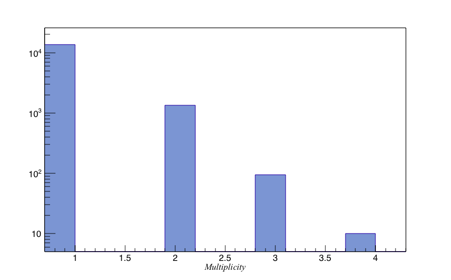

.. _polyplopia:

Polyplopia
==========

.. toctree::
   :maxdepth: 3
   
   release_notes
   poisson_merger
   polyplopia
   mphit_filter

Overview
--------

This project contains tools for generating Monte Carlo IceCube events consisting of multiple primaries (and secondaries) that generate coincident detector hits. These types of events are often misreconstructed as upgoing muons and are difficult to distinguish from such.

At this time, the project consists of the following two modules:

   * I3PolyplopiaExp takes events from multiple frames and merges events of various multiplicities by sampling time intervals from an exponential distribution based on the rate of minimum-threshold events.

   * PoissonMerger injects background event read from a separate file ontop of primary events in the chain by sampling from a Poisson distribution.  This C++ module replaces an older Python module and can merge events at the I3MCTree-level after generation. This is likely to become the prefered way since the combined MCTree can be processed through photon propagation at once instead of having to do this in separate tasks during production.
   * MPHitFilter removes events that don't produce light in the detector and removes branches of I3MCTrees whose particles don't produce enough PEs in the detector, making it much easier to read and reducing the storage requirements.

We inject this cosmic-ray background (read from a separate file) on top of primary or signal events in the main simulation chain by sampling from a Poisson distribution with a probability   

.. math::
	f(k,\lambda) = \frac{e^{-\lambda}\lambda^k}{k!},

where :math:`\lambda = R \Delta t` is the average number of muons entering the detector volume within a time window :math:`\Delta t`, given a rate R, and k is the number of coincident showers in that same interval. Background showers are injected with a uniform time distribution over the interval :math:`\Delta t`.
The default time window :math:`\Delta t` is chosen to have a value of :math:`40~\mu s` but can be made arbitrarily large given enough memory needed to store each shower element, CPU needed to propagate each background shower, and GPU to propagate the emitted photons. The background showers are assumed to be randomized in terms of energy and composition a priori.

This approach is used for injecting cosmic-ray muon background into both neutrino ''signal'' events as well as weighted cosmic-ray shower events. 
In the case of the latter, a single weighted cosmic-ray shower is treated as a "signal" but in this case k in the equation above would be replace by k-1 in order to avoid over-counting.

An alternative to using full CORSIKA cosmic ray simulations is to replace the background shower file by a muon stream service implemented from the MuonGun generator described in Muongun provided it is configured to produce a muon spectrum and bundle multiplicity comparable to the one that results from the Polygonato cosmic-ray spectrum and mass composition. This approach, although less, accurate provides a much faster way to produce background coincidences and can produce muons on demand, thus saving a lot of computation time.  

The C++ PoissonMerger module makes use of a CoincidentEventService that can be drop-in replaced with other event services such as a MuonGun-based service.

