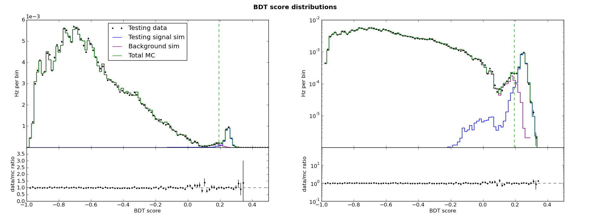

.. _man_bdt_intro:

Introduction to boosted decision tree classifiers
=================================================

A BDT, or boosted decision tree classifier, consists of a *forest* of
decision trees. A user specified number of individual decision trees
are trained sequentially, with a boosting process in between each
training. Boosting consists of adjusting the weights of individual
events according to whether the previously trained tree classifies
them correctly. pybdt uses the AdaBoost algorithm for boosting.

The score of an event is a weighted average of the scores the event
receives from each tree in the forest.

A BDT may informally be called a "boosted decision tree", but it must
be understood that there are actually many trees (typically hundreds),
and that boosting is a process that occurs between the training of
consecutive trees.

AdaBoost
--------

After a tree is trained, we can compare the training sample scores
:math:`s_i` with the training sample true identities :math:`y_i`.
We define a function to indicate whether an event is classified
incorrectly: :math:`I(s,y)=0` if :math:`s=y` and 1 otherwise. Then we
calculate the error rate for the tree:

.. math::

    e = \frac{\sum{}_i w_i I(s_i,y_i)}{\sum{}_i w_i}

and the boost factor for the tree:

.. math::

    \alpha = \beta \cdot \ln\left(\frac{1-e}{e}\right).

Here, :math:`\beta` is a user-specified boost strength (typically
between 0 and 1). Once we have the boost factor for the tree, we
adjust the weights:

.. math::

    w_i \to w_i\cdot\,\exp [\alpha\cdot I(s_i,y_i)].

Finally, the weights are renormalized so that :math:`\sum{}_i w_i = 1`.
The new weights are used to train the next tree. After that, the
weights are boosted yet again. Boosting is cumulative; the weights are
never reset to their original values.

Calculating the BDT score
-------------------------

Consider a set of trees with indices :math:`m`. The boost factor
:math:`\alpha_m` calculated during boosting becomes the weight of that tree
during scoring. When not using leaf purity information, the score of an
event is

.. math::

    s_i = \frac{\sum{}_m \alpha_m (s_i)_m}{\sum{}_m \alpha_m}.

However, if the scores are calculated using purity information, the SAMME.R
prescription is applied instead.  See J. Zhu, H. Zou, S. Rosset, T. Hastie.
“Multi-class AdaBoost”, 2009.

Example BDT score distribution
------------------------------

A BDT cannot say definitively whether a given event is a signal or
background event. However, most signal events will receive a higher
score than most background events. A BDT essentially synthesizes many
cut variables with potentially complex relationships into a single,
simple cut variable with very good signal/background separation. Here
are the score distributions for the BDT in the :ref:`ABC example
<man_example>`:

The same information is shown on the left on a linear scale and on the
right on a log scale. Note the following features:

1.  The total MC is background-dominated left of about 0.2 and signal
    dominated right of about 0.2.
2.  Data/MC agreement is quite good, as it must be by construction.
3.  Data/MC agreement is at its worst near the transition from
    background-dominated to signal-dominated, and at the signal-like
    tail where very few events remain.

.. _man_ref_contamination:

Recall that the background training sample consists of "data" events.
In the training data sample, like in the testing data sample, some
events are signal like. This is no problem for a BDT, which can
tolerate some level of contamination in the training samples. The
training algorithm cannot find a way to separate signal-like training
background events from training signal events, so it simply never
separates them. This is what allows good data/MC agreement even in the
signal-like region.

