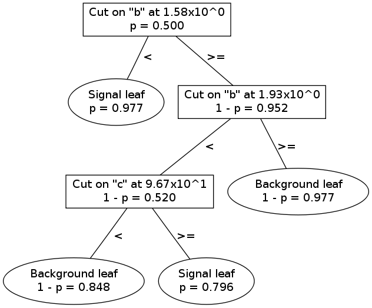

.. _man_dt_intro:

Introduction to decision tree classifiers
=========================================

A decision tree consists of a binary tree with a cut on one variable
specified at each node except at the *leaf nodes*, which have no child
nodes. A leaf node may be either a *signal leaf* or a *background
leaf*. The rest of the nodes may be referred to as *split nodes*.

An event of unknown class is classified by tracing its path through
the tree until a leaf node is reached.

Classification example
----------------------

An example is the easiest way to understand how decision trees work.
Below is a visualization of the first decision tree from the :ref:`ABC
example <man_example>`.

To see how a single decision tree classifies an event, consider the
following sample event:

+-----------+-------+-------+-------+
| Variable  | a     | b     | c     |
+===========+=======+=======+=======+
| Value     | 2     | 1.7   | 120   |
+-----------+-------+-------+-------+

Using the example decision tree, the event is classified as follows:

1.  At the root node (the one at the top), the cut is at :math:`b = 1.58`.
    This event has :math:`b = 1.7`, so it descends to the
    right.
2.  At the 2nd node, the cut is at :math:`b = 1.93`; this event
    descends to the left.
3.  At the 3rd node, the cut is at :math:`c = 96.7`; this event
    descends to the right.
4.  The event lands in a signal leaf.

Thus, on the -1 to +1 scale used by pybdt, this event will be scored
+1 by this decision tree.

Some definitions
----------------

We can define the following quantities for each node, based on the
events in the training example which pass through (for splits) or end
up in (for leaves) that node:

- :math:`w_s`
    The total weight of signal training events in this node.

- :math:`w_b`
    The total weight of background training events in this node.

- :math:`W`
    The total weight of training events in this node:
    :math:`W=w_s+w_b`.

- :math:`n_s`
    The number of signal training events in this node.

- :math:`n_b`
    The number of background training events in this node.

- :math:`N`
    The total number of training events in this node:
    :math:`N=n_s+n_b`.

- :math:`p`
    The signal purity in this node: :math:`p = w_s / (w_s + w_b)`.
    Note that :math:`1 - p = w_b / (w_s + w_b)` is the background
    purity in this node.

We use the following quantities for the :math:`i` th event:

- :math:`x_i`
    The set of cut variable values for the event.
- :math:`y_i`
    The true identity of an event: +1 for signal events, -1 for
    background events.
- :math:`w_i`
    The weight of the event.
- :math:`s_i`
    The score of the event.

Scoring using purity information
--------------------------------

Node purity may be taken as an indicator of signal-like-ness. Assuming
that the training samples were representative, an event landing in a
higher purity leaf may be more likely to be correctly classified than
an event in a lower purity leaf. Thus, there are two ways to score an
event: with or without purity information. We may denote a score using
purity information as :math:`s_p`.

In the classification example above, purity information was not used.
The example event could only receive a score of either -1 or +1. For a
single decision tree, using purity information amounts to calculating
a score by simply scaling the leaf node purity: :math:`s_p = 2p - 1`.
Thus, the example event receives a purity score of :math:`s_p = 0.592`.

Decision tree training
----------------------

Decision tree training is a recursive process. At a given node, an
ensemble of signal training events and background training events
remains. Each variable is histogrammed --- the number of bins may be
chosen by the user --- and then the algorithm considers placing a cut
at each bin boundary in each histogram. The cut which most increases
the signal-background separation is chosen. The training samples are
split according to the cut: events on the less-than side go to a new
node to the left, and events on the greater-than side go to a new node
to the right. The process is repeated recursively for the left and
right subsamples. Training continues until a stopping criterion is
reached.  A leaf is a signal leaf if :math:`p>1/2` or a background
leaf if :math:`p<1/2`.

Quantifying cut effectiveness
^^^^^^^^^^^^^^^^^^^^^^^^^^^^^

For each cut variable and value considered, the total weight of signal
and background training events which would descend to the left and
right, :math:`W_L` and :math:`W_R` are calculated. Then the child node
purities are calculated: :math:`p_L` and :math:`p_R`. Given the
purity, a separation criterion may be calculated. Here are the
available separation criteria available in pybdt:

- gini (the default)
    :math:`S_G(p) = p\cdot(1-p)`

- cross entropy
    :math:`S_C(p) = -p\cdot\ln(p) - (1-p)\cdot\ln(1 - p)`

- misclassification error
    :math:`S_M(p) = 1 - \max (p, 1-p)`

With the separation criterion specified by the user, the separation
gain is calculated for each cut considered: :math:`\Delta S = W\cdot S(p) - W_L\!\cdot S(p_L) - W_R\!\cdot S(p_R)`.
Whichever cut maximizes the separation gain :math:`\Delta S` will
be selected.

Stopping criteria
^^^^^^^^^^^^^^^^^

Splitting continues until one of the following conditions is reached:

-   The user-specified maximum depth is reached.
-   A node has either only signal or only background training events
    remaining.
-   The best cut would result in a node with less than the
    user-specified minimum number of events.
