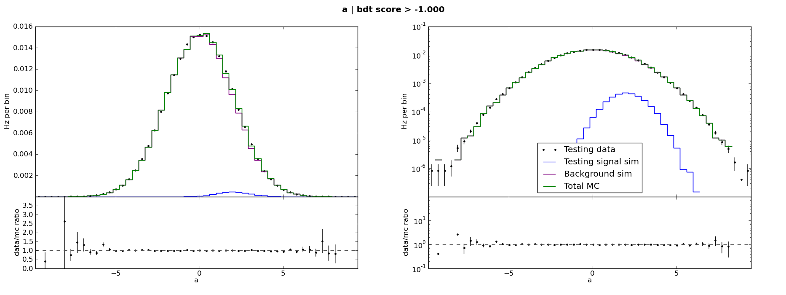
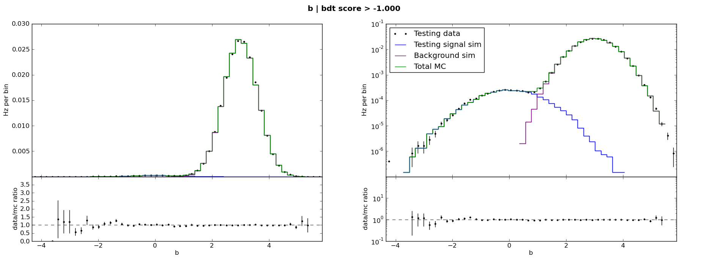
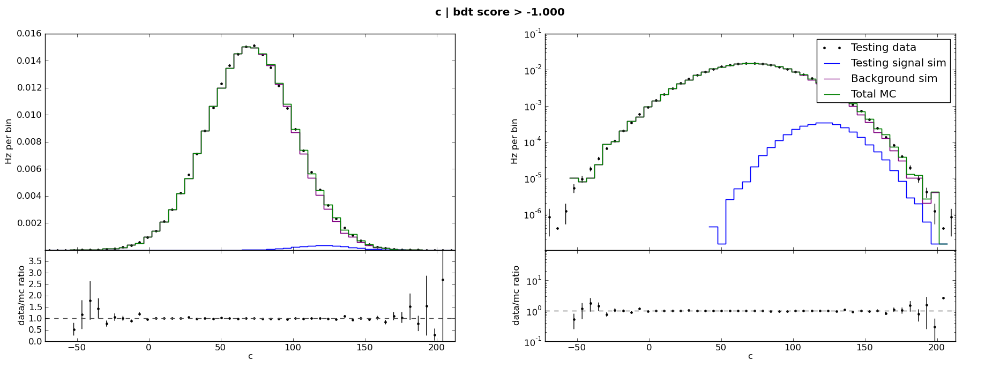

.. _man_example:

The ABC example
===============

pybdt is bundled with a series of example scripts which demonstrate
most of its features. The scripts are located in
``pybdt/resources/examples/``.

The bundled example generates "signal MC", "background MC", and "data"
event samples containing variables a, b and c. Each variable is
Gaussian distributed in both signal and background, but the means and
widths of the distributions are different in signal and background.
The "data" consists of many background-like events plus some
signal-like events.  Thus the example data mimics real high energy
physics data, where signal and background may both be simulated, and
where data consists mostly of background events but with some signal.
For example, in an IceCube :math:`\nu_\mu` search, most data events at
low cut levels are background events due to cosmic ray muons, but some
fraction of the events are really upgoing neutrinos.

In the example scripts, the "signal MC" and "data" samples are divided
into training and testing samples. The signal training and testing
samples are equal size, while the background training sample is much
smaller than the background testing sample. The training samples are
used to generate a BDT classifier, and the testing samples are used to
quantify the classifier's performance.

We will refer to these scripts collectively as "the ABC example",
named for the variables that make up its events, throughout this user
manual.

Input variable distributions
----------------------------

Here are the distributions of a, b, and c:

