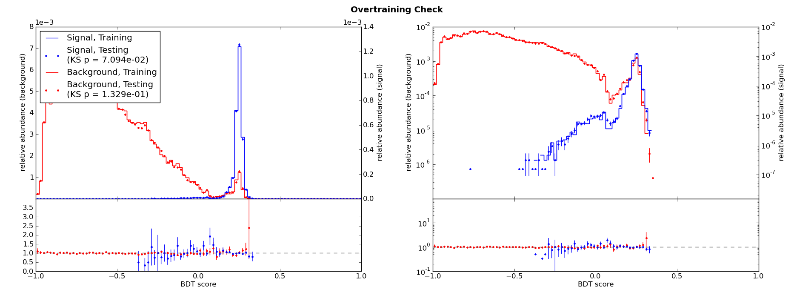
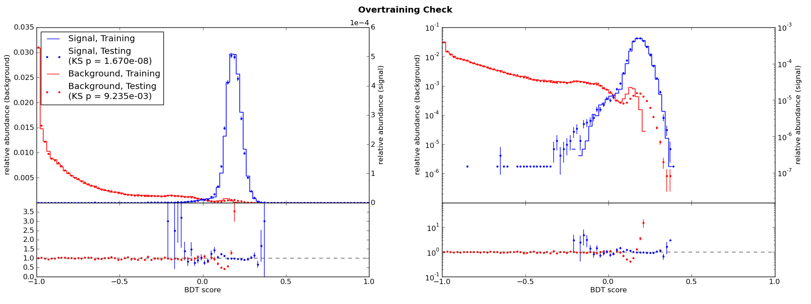
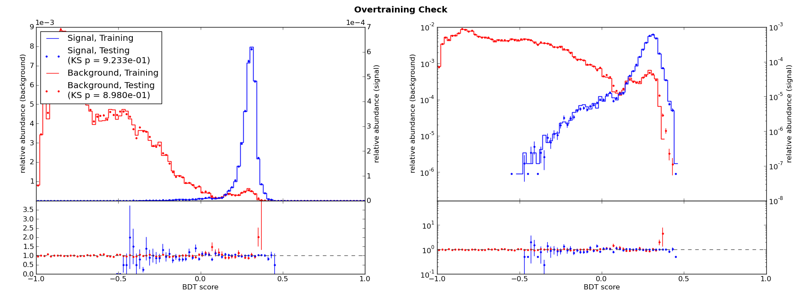
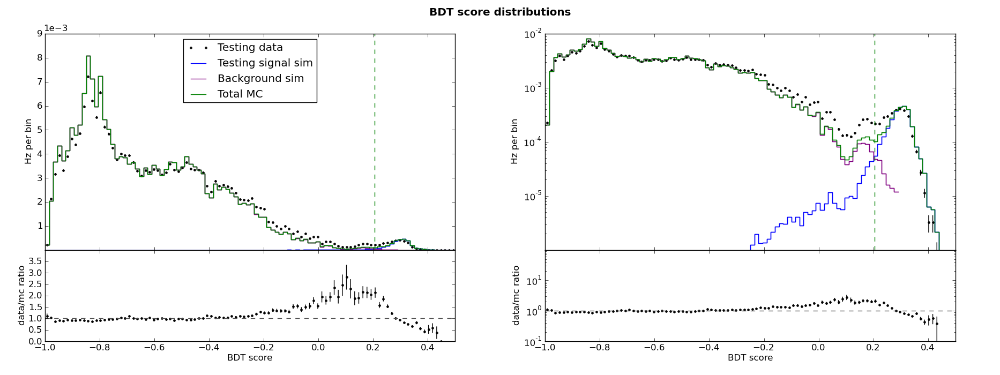

.. _man_overtraining_intro:

Introduction to overtraining
============================

Consider training a single, arbitrarily deep decision tree with no
minimum number of events per node. For the events in its training
sample, it would give perfect signal/background separation, but we
could not expect that it would also give perfect separation for a
separate testing sample. This classifier would certainly be
*overtrained*.

Overtraining occurs when a classifier models signal/background
differences that are specific to the particular training sample used.
Proper training requires that a classifier models signal/background
differences that are present in one or more separate testing samples
as well as in the unknown events which we ultimately intend to
classify.

There are two common types of overtraining which must be avoided:
training sample overtraining, and data/Monte Carlo overtraining.

Training sample overtraining
----------------------------

The extreme example above --- a single decision tree tuned to classify
every single training event correctly --- is an instance of *training
sample overtraining*. Training sample overtraining can be detected by
comparing the score distributions for the training and testing samples
for both signal and background.

The `Kolmogorov Smirnov test
<http://en.wikipedia.org/wiki/Kolmogorov%E2%80%93Smirnov_test>`_
provides a :math:`p` value equal to the statistical probability that
two samples are drawn from the same distribution.  pybdt's Validator
object can generate overtraining check plots which include the
training--testing :math:`p_{KS}` value for signal and background. Here
is the overtraining check for the :ref:`ABC example <man_example>`:

For comparison, here is the overtraining check for different training
parameters which result in substantial overtraining:

Notice in the latter example that the separation is poorer for the
testing samples, shown in dots, than for the training samples, shown
in solid lines. The :math:`p_{KS}` values are now much smaller.

The smaller the :math:`p_{KS}`, the greater the overtraining. Since
the training and testing samples will never be identical, a very small
degree of overtraining may be unavoidable. As a rule of thumb, it is
recommended to try to reduce overtraining if
:math:`p_{KS}\,\lesssim\,0.01`, especially if the separation is
visibly poorer for the testing samples than for the training samples.

Data/Monte Carlo overtraining
-----------------------------

In some applications, real data may be used as background for
training. For example, in a GRB-:math:`\nu_\mu` search in Icecube, we
are looking for muon neutrinos occuring at the same time and in the
same direction as Gamma Ray Bursts reported by other experiments. For
many searches with such a well-defined on-time window, the
background may be much better represented by real data taken during
in the off-time window than by background MC.

Applications training on MC for signal but data for background are
subject to *data/Monte Carlo overtraining*. Since MC can never
reproduce real data perfectly, not all signal/background differences
in the training sample are really due to the difference between, e.g.,
a muon neutrino and other kinds of events. Some differences are due
simply to imperfections in simulation. If the training stopping
criteria are not strict enough, then decision tree training can
proceed far enough that cuts are made which separate signal-like data
events from simulated signal events. In other words, the argument made
:ref:`here <man_ref_contamination>` that BDTs are robust against a
small amount of contamination is no longer valid.

Data/MC overtraining can be more difficult to detect because the
standard overtraining check described above will not reveal it. It is
also the more dangerous type of overtraining. Training sample
overtraining may still yield a classifier which performs acceptably
well on testing or unknown samples. But data/MC overtraining yields a
classifier which specifically rejects signal-like events in data: you
will only be able to find signal-like simulated events!

The signature of Data/MC overtraining is a skewed BDT score
distribution. Near the background-dominated to signal-dominated
transition, there will be an excess of data relative to MC. In the
signal-like region, there will be a deficit of data relative to MC.

A contrived example will demonstrate what this looks like. A copy of
the :ref:`ABC example <man_example>` was made which generates
slightly different distributions for "simulation" and "data" events.
Here is the new overtraining check plot:

From these plot and the KS tests, we might conclude that there is no
overtraining. But then we look at the BDT score distributions:

Here we can see the data/MC skew as described above. Any large data/MC
disagreement in the BDT response is a reason for concern. If the
disagreement follows this particular pattern, it is especially
important to try to reduce overtraining.

