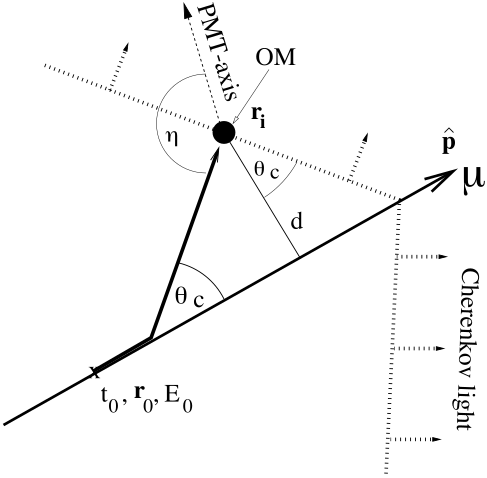
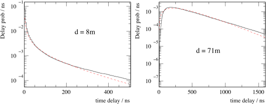

.. _rpdf-algorithm:

=======================
Algorithms
=======================

This document provides a detailed description of the algorithms used by the rpdf project.
The algorithms discusses here were developed for AMANDA and continued on to
IceCube with very little modification. A more detailed description can be
found in the AMANDA muon reconstruction paper\ [#]_.

Overview
========

The most generic description of likelihood based reconstructions is that the
muon track being reconstructed is described by a set of parameters
:math:`{\bf a} = \left(t_0,{\bf r}_0,{\bf \hat p}_0\right)` and a set
of reconstructed pulses :math:`{\bf x}`. The likelihood is described as
the product of the probability of each pulse:

.. math::

   \mathcal{L}({\bf x}_i|{\bf a}) = \prod_i p(x_i|{\bf a})

where the multiplication index denoted the :math:`i^{\rm th}` DOM. For
numerical reasons it is easier to maximize the logarithm of the likelihood

.. math::

   \Lambda({\bf x}_i|{\bf a}) = \log\left[\mathcal{L}({\bf x}_i|{\bf a})\right] =  \sum_i \log(p(x_i|{\bf a}))

Maximizing :math:`\Lambda` is performed by the :ref:`Gulliver` reconstruction suite.
The rest of this document describes the calculation of the :math:`(p(x_i|{\bf a})`
portion of the calculation.

Calculating the probabilities can be broken up into two steps: the geometrical
parameters which are specific to the Cherenkov cone emitted by muons as they
pass through matter. The second step is to calculate the probability of photons
reaching the DOM as travel through the ice.

Geometric Algorithms
====================

A muon traveling through ice will emit light in a Cherenkov pattern. Without any
scattering one would expect all the Cherenkov light to arrive at the DOM at the
time of the Cherenkov cone.
The PDFs in rpdf are calculated as a function of time, with reference to the geometrical time :math:`t_{geo}`. The geometrical time is calculated as the expected time of arrival, relative to the given :math:`t_0`, for light traveling along the Cherenkov cone without scattering or jitter. This includes the time taken for the particle to travel from the :math:`t_0` to the light emission point.
Since light scatters in ice, light will always come after :math:`t_{geo}`.

The amount of scattering in the light
will depend on how far the average photon traveled through the ice, this is
approximated by :math:`d`, the distance of closest approach of the muon to the DOM
in question. Due to the fact that a PMT facing toward a light source will see no
delay in photons, but a PMT facing away from the source will see additional
scattering due to the fact that it mostly sees back scattered photons an
additional correction is applied with the PMT angle :math:`\eta`.
Based on Monte Carlo simulations of light propagation the effective distance
:math:`d_{eff}` was parameterized with a polynomial:

.. math::

   d_{eff} = 0.8395 d + 3.094 - 3.946\cos\eta + 4.636\cos^2\eta

This effective distance, :math:`d_{eff}`, is used to calculate the photoelectron
probability. Together :math:`t_{geo}` and :math:`d_{eff}` are referred to as the
geometrical parameters of reconstruction.

   **Figure 1** The geometry of muon reconstruction. A muon described as passing through a
   vertex :math:`{\bf r}_0` at time :math:`t_0` with velocity vector
   :math:`{\bf \hat p}`. The geometrical distance :math:`t_{geo}` is calculated
   by calculating how long it take the muon to traverse to the Cherenkov cone
   indicated. The distance of closest approach, :math:`d`, is needed to estimate
   the amount of scattering. The PMT axis :math:`\eta` the angle between incident
   light and the direction of the PMT in the DOM is also used to calculate
   scattering.

Derivation
----------
   
This section contains a derivation of the geometrical parameters for muon
reconstruction. First we need to calculate intermediate values,
the distance along the track from the vertex to the point of closes approach is:

.. math::

   d_{t} = \left({\bf r}_i - {\bf r}_0\right)\cdot{\bf \hat p}

and the distance of closes approach is the cross product:

.. math::

   d = \left({\bf r}_i - {\bf r}_0\right)\times{\bf \hat p}

The time it takes a muon to travel from the vertex to the emission point is going
to be the distance along the track minus the leg of the large triangle divided by
the speed of the muon:

.. math::

   t_{\mu} = \frac{d_{t} - d\tan\theta_c}{c}

Where :math:`\theta_c` is the Cherenkov angle:

.. math::

   \theta_c = \cos^{-1}\left(\frac{1}{\eta_{ph}}\right)

where :math:`\eta_{ph}` is the phase velocity index of refraction.

The time it takes the photon to travel from the emission vertex to the OM is the
hypotenuse of the large triangle divided by the speed of light in the medium

.. math::

   t_{\gamma} = \frac{ d\csc\theta_c}{ c/\eta_{gr}} = \frac{ \eta_{gr} d}{\sin\theta_c}

where :math:`\eta_{gr}` is the group velocity index of refraction in ice. The geometric time is then:

.. math::

   t_{geo} = t_{\mu}+t_{\gamma} = \frac {1}{c}\left[d_{t}+
   d\left(\frac{\eta_{gr}}{\sin\theta_c}-\frac{1}{\tan\theta_c}\right)\right]

.. note::

   In the AMANDA era it was assumed that the group and phase velocities were the
   same in ice which lead to a simpler expression for :math:`t_{geo}` which was simply
   :math:`t_{geo} = (d_t + d\tan\theta_c )/c`. This is what is stated in the AMANDA
   reconstruction paper, it is incorrect. The correct formula is what is stated
   above.

Photoelectron Probability
=========================

In general, a photoelectron probability is the probability that a photon will
hit a given DOM at time :math:`t` given a certain track hypothesis
:math:`(t_0,{\bf r}_0,{\bf \hat p}`, and is written as
:math:`p(t;t_0,{\bf r}_0,{\bf \hat p})`.
In practice it is difficult to minimize complicated photoelectron probabilities
and they are simplified to :math:`p(t_{res};d_{eff})` where :math:`t_{res}` is
the residual time: the time that an unscattered photon will hit the DOM, and
:math:`d_{eff}` is the effective distance discussed above.
The residual time is the time of the hit subtracted from the expected geometric time:

.. math::

   t_{res} = t_{hit}-t_{geo}-t_0

The Pandel Function
===================

The function used to characterize light propagation for muon reconstructions
is called the Pandel function. It is named after Dirk Pandel a diploma student
at DESY working on the Baikal Deep Underwater Neutrino Telescope\ [#]_.
He derived the relation empirically from observing laser light scattering through
water. It works just as well for light traveling through ice although ice has
different parameters.

The theoretical basis for the Pandel function is as follows: imagine a photon
traveling through a mostly transparent medium where it occasionally scatters.
If the ice has a scattering length :math:`\lambda` and you measure at a distance
:math:`d`, then the number of scatters you expect will be :math:`d/\lambda`, and
the distribution of the actual number of scatters will be Poisson distribution
with rate parameter :math:`d/\lambda`. If each scattering event only deflects the
photon by a small angle that is normally distributed with shape parameter,
then the delay can be characterized by a random process where the
number of interactions is Poisson and the amount of delay is a random walk with
the number of steps sampled from the Poisson distribution. This random process is
the well known `gamma distribution <https://en.wikipedia.org/wiki/Gamma_distribution>`_.

.. math::

   P_{Pandel}(t_{res};\rho,\xi) =
   \frac{1}{\Gamma(\xi)}
   \rho^\xi {t_{res}}^{\xi-1}e^{-\rho\cdot t_{res}}

where

.. math::
   \xi = \frac{d_{eff}}{\lambda} \qquad
   \rho=\frac{1}{\tau} + \frac{c_{\rm medium}}{\lambda_a}

where :math:`\lambda` is the scattering length, :math:`\lambda_a` is the
absorption length, and :math:`\tau` which is due to the non-linearity of
scattering in the ice. Several ice models were considered with AMANDA,
H2 was considered as standard and is as follows:

.. math::

   \tau = 556.7\,{\rm ns} \qquad \lambda_{a} = 98.0\,{\rm m}
   \qquad \lambda = 33.29\,{\rm m}

The Pandel function was derived for a point source of photons with the same
direction such as a laser. However, simulation of photons traveling through
a scattering medium show that it is an appropriate PDF for Cherenkov photons
from muon tracks as well.

   **Figure 2**
   Comparison of the Pandel function (dashed curves) with the detailed simulation
   based on light traveling through a scattering medium (black histograms) at
   two different distances :math:`d` from the muon track.
   Note that the function is very sharply peaked for the observer close to the
   track, while for the further away observer the function is not.

Convoluted Pandel Function
==========================

The Pandel function by itself does not make a good likelihood, it is undefined for
:math:`t_{res}<0` and exhibits asymptotic behavior at :math:`t_{res}=0` when the
track is close to the DOM. In order for the minimization algorithm to work the
likelihood must be defined for all values of `t_{res}` and the likelihood must
increase as the fit approaches the physically allowed region.
In addition, negative values of
the residual time are possible due to timing uncertainties in the DOMs as well
as pre-pulses.  To solve these the Pandel function is convoluted with a normal
distribution, this makes the value of the function acceptable in the negative
region. The convolution is defined as:

.. math::

   P_{\rm conv}(t_{res},d_{eff},\sigma) = \int_0^\infty \frac{{\rm d}x}{\sqrt{2\pi\sigma^2}}
   P_{Pandel}(t;d_{eff}) e^{-(t_{res}-t)^2 / 2\sigma^2}

where :math:`\sigma` is called the jitter. In principle the jitter should be the
timing uncertainty of the DOMs which is about 3 ns. In practice better results
are obtained if the jitter is set unphysically large. The default is
:math:`\sigma = 15\,{\rm ns}`. The integral has an analytic solution\ [#]_:

.. math::     

   P_{\rm conv}(t_{res};d_{eff},\sigma) =
   \frac{\rho^\xi \sigma^{\xi-1} e^{-(t_{res})^2/2\sigma^2}}{2^{(1+\xi)/2}}
   \left[
   \frac{_1F_1(\frac{1}{2}\xi,\frac{1}{2},\frac{1}{2}\zeta^2)}{\Gamma(\frac{1}{2}(\xi+1))}
   -\sqrt{2}\zeta\,\frac{_1F_1(\frac{1}{2}(\xi+1),\frac{3}{2},\frac{1}{2}\zeta^2)}{\Gamma(\frac{1}{2}\xi)}
   \right]

where

.. math::

   \zeta = \rho\sigma - \frac{t_{res}}{\sigma}

and :math:`_1F_1` is the confluent hypergeometric function.
The sum of two confluent hypergeometric functions is a class of functions
refered to as the parabolic cylinder functions\ [#]_. However the parabolic
cylinder functions typically included in mathematical packages are not useful
for our application. Methods for evaluating :math:`_1F_1` are available in the
``GSL`` library, but they are slow and the difference between them can cause
numerical artifacts in certian regions.

.. figure:: 10nss.svg
   :align: center
   :width: 50%

   **Figure 3** Different Regions used for the approximation of the convoluted
   Pandel function.

A scheme for quickly approximating the solution was developed\ [#]_.
The Gaussian-convoluted Pandel calculation is broken down into five regions
shown in figure 3.  In region 1 (small distances, small time residuals), the
analytic representation can be used exactly.  In the other regions, the analytic
representation results in a GSL over/underflow error, and an approximation is
used.  Approximately 90% of the evaluations (for IceCube data) fall into region 1.
To improve performance in this region, we use three different techniques to
evaluate the PDF:

1.  For large time residuals and large distances, we use the existing
    calculation of the Gaussian-convoluted Pandel PDF.  This calculation takes
    the difference of 1F1 confluent hypergeometric functions computed by GSL.
2.  For negative time residuals (eta > 1.35), the two terms in the above
    computation are almost equal, resulting in poor conditioning.  For this
    portion of region 1, we instead use Tricomi's hypergeometric function, which
    is well-conditioned and more precise.
3.  For small time residuals and small distances, we can efficiently compute
    :math:`_1F_1` hypergeometric functions using a power series by precomputing
    the denominators in the hypergeometric power series terms.  This is
    approximately 10x faster than GSL with similar accuracy.

Jitter is set in ``I3RecoLLH`` module with the parameter ``JitterTime``, the
default is 15 ns.

DOM Likelihoods
===============

The above mentioned Pandel function only pertains to a single photon incident on
a single DOM. To calculate a likelihood for an event hypothesis we first need
to combine the hits from a DOM. The obvious thing to do would be to simply add
the Pandel function from every photon that hits a DOM in a particular event.
Unfortunately, since we are already dealing with a crude approximation adding too
much information makes the likelihood space too complicated which makes it
difficult for the minimizer to find the global minimum. Many proposals were tried
in the AMANDA days, only two of them were found useful in IceCube:

- SPE1st - This method simply calculates the Pandel function at the time of the
  first hit and calls it a day. The rational behind this is that the first hit
  is most likely incurred less scatters than photons which arrive later, and hence
  contains more information about the track.
- MPE - Calculates the probability that the first hit arrived at the specified
  time considering that there were N hits total. This works under the same
  rational that the first hit contains more information, but takes into
  consideration that events with more hits moves the probability of the first
  hit to earlier times. 

To calculate the MPE likelihood consider the distribution of the first hit of a
DOM which experiences N hits. It is the probability of a hit at :math:`t_{res}`
times the probability that all the other hits occur afterwards:

.. math::

   p^{MPE}(t_{res}) =
   p(t_{res})\cdot N\cdot \left[\int_{t_{res}}^{\infty} p(t_{res}){\rm d}t\right]^{N-1}
   = N\cdot p(t_{res})\cdot {\rm SF}(t_{res})^{N-1}

where :math:`{\rm SF}(t_{res})` denotes the survival function of the Pandel function.
This requires an analytic solution to the survival function. 
``rpdf`` uses a method of quickly evaluating this integral that was developed by Dima Chirkin.
A detailed explanation of this method is beyond the scope of this document.

The ``DOMLikelihood`` parameter in ``I3RecoLLH`` selects which method to use.
It takes a string, valid options are ``"SPE1st"`` (the default) and ``"MPE"``.

Approximation
-------------

An fast approximation for calculating the survival function of the convoluted Pandel
was developed by D. Chirkin\ [#]_. It works by replacing the Gaussian with a box
function of the same first and second moment. It then calculates the integral of
the Pandel function inside the box using a number of equally spaced steps.
In addition, there is a correction due to the singularity in the Pandel function
at :math:`t_{res}=0` calculated separately. This approximation has been shown to
to be very accurate.

Noise
=====

Since DOMs are subject to random noise an additional noise term is added to the
DOM likelihood. Noise is not easy to implement in mathematically correct way.
It was determined to create a "noisy PDF" by simply adding a small constant
to the PDF,  This is a constant with respect to time. In principle the value
used should be the same as the observed noise rate of the DOMs. In practice, it
was found that using a value higher than the physical value gives better reconstruction results.
This can be set with the parameter ``NoiseProbability`` in the ``I3RecoLLH`` module.

References
==========

.. [#] \J. Ahrens, et al.,
       "Muon Track Reconstruction and Data Selection Techniques in AMANDA",
       NIM A524, p.169-194 (2004).
       `astro-ph/0407044 <http://arxiv.org/abs/astro-ph/0407044>`_.

.. [#] \D. Pandel,
       "Bestimmung von Wasser- und Detektorparametern und Rekonstruktion von
       Myonen bis 100 TeV mit dem Baikal Neutrinoteleskop NT-72,"
       Diploma Thesis, Humboldt-Universität zu Berlin, 1996 (in German).
       https://docushare.icecube.wisc.edu/dsweb/Services/Document-74814.
       
.. [#] \G. Japaridze and M. Ribordy,
       "Realistic arrival time distribution from an isotropic light source",
       `astro-ph/0506136 <https://arxiv.org/abs/astro-ph/0506136>`_.

.. [#] \R. Vidunas and N. M. Temme,
        "Parabolic Cylinder Functions: Examples of Error Bounds For Asymptotic Expansions",
        `math/0205045 <https://arxiv.org/abs/math/0205045>`_.

.. [#] \N. van Eijndhoven, O. Fadiran, G. Japaridze,
       "Implementation of a Gauss convoluted Pandel PDF for track reconstruction
       in neutrino telescopes,"
       Astroparticle Physics 28, 456 (2007).
       `arXiv:0704.1706 <http://arxiv.org/abs/0704.1706>`_.

.. [#] \D. Chirkin
        "New implementation of convoluted MPE pandel function",
        https://icecube.wisc.edu/~dima/work/WISC/cpdf/a.pdf
