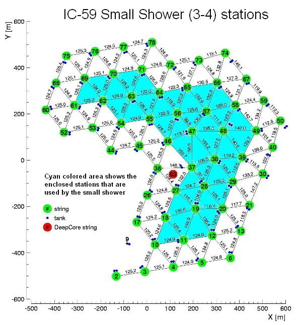

.. _smallshower-filter:

smallshower-filter
==================

Filtering small shower events (three or four neighbouring stations) out of all the other IceTop events.

This project is maintained by Timo Karg <timo.karg@desy.de>.

.. toctree::
   :maxdepth: 1
   
   release_notes

Overview
----------------

This IcePick selects small, fully contained IceTop events. Fully contained
means that none of the triggered stations are on the border of the array. In
addition the triggered stations are required to be adjacent to each other.
The allowed combinations for IceCube 59 are shown in the picture below.

This module is intended to be run after tpx and topeventcleaning,
see also the example script resources/examples/run_smallshower-filter.py.
Those modules separate SLC and HLC pulses and do a simple event cleaning.
The smallshower-filter itself currently does not distinguish SLC and HLC
pulses.

Parameters
^^^^^^^^^^

``FilterGeometry``
  Select the filter geometry. Each
  IceCube geometry requires a different set of allowed station clusters.
  Allowed values: IC40, IC59, IC79, IC86
``TopPulseKey``
  Input IceTop pulse series.
``NStationResultName``
  If set, write the number of stations
  as an I3Int into frame under this name.

In addition, this module inherits the parameters of I3IcePickModule. See the
IcePick documentation for details.
