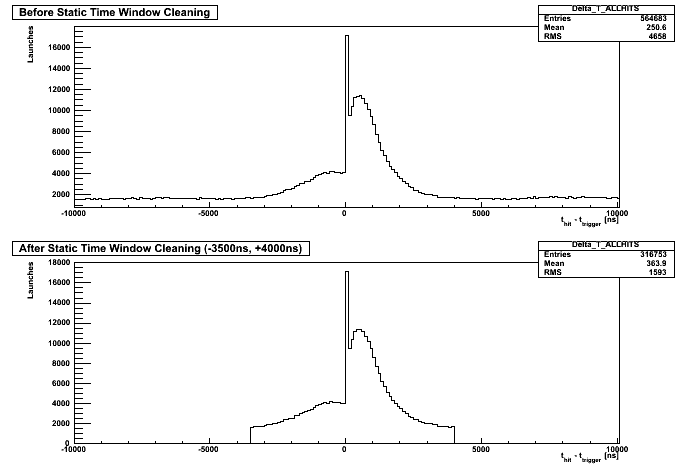

.. _static-twc:

Static-TWC
==========

This projects contains a templated module, which applies a static time window cut on input
DOMLaunchSeriesMaps or RecoPulseSeriesMaps. It calculates and cuts on the time
differences of DOMLaunches/RecoPulses to trigger times.

.. toctree::
   :maxdepth: 1
   
   release_notes

Also see the `doxygen <../../doxygen/static-twc/index.html>`_ docs.

Usage
-----

The module I3StaticTWC<T> is conditional and templated. It can be used in two modes.

* In the first mode (`FirstTriggerOnly=false`), the first and the last time of specified
  triggers (by TriggerConfigIDs) are used to define the limits of the cut window
  (extended by WindowMinus and WindowPlus).
* In the second mode (`FirstTriggerOnly=true`) only the first of the specified triggers is used
  as reference and the time window specified by WindowMinus and WindowPlus is centered around
  it. 

It requires the following parameters set properly:

* `InputResponse`: Input response map you want to clean, i.e., a DOMLaunchSeriesMap (`InIceRawData`)
  or RecoPulseSeriesMap (`OfflinePulses`). Note: the type name `T` in the module name must match
  the type name of the frame object, i.e. `I3StaticTWC<I3RecoPulseSeriesMap>` for an
  `I3RecoPulseSeriesMap`.
* `OutputResponse`: Name of the output response map
* `TriggerConfigIDs`: List of the TriggerConfigIDs (integers) the module should look for,
  e.g. [1010] for SMT3
* `TriggerName`: Name of TriggerHierarchy from the frame
* `WindowMinus`: Time window from the reference trigger time backwards (positive)
* `WindowPlus`: Time window from the reference trigger time forwards
* `FirstTriggerOnly`: Bool to decide whether to use only the first relevant trigger time or
  the first and the last, see module description

A verification plot that this algorithm works:

The plot was made with IC79 Real data ( June 4 2010 ) with SMT3 trigger condition.
Upper plot is delta-t distribution before the cleaning while the bottom plot is after cleaning.

Two example scripts in `resources/examples` further illustrates the usage.
They also show if the STWC works with your I3 files.
